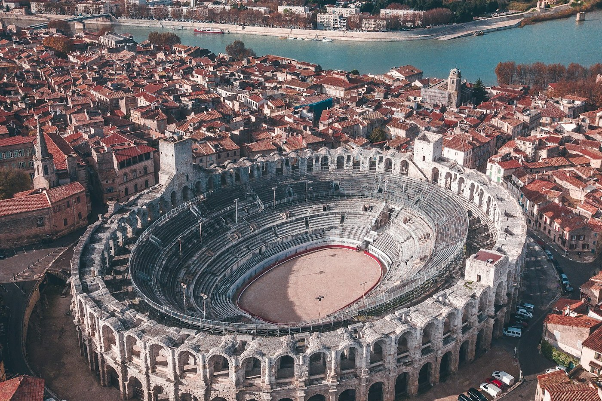

# Arles — the arena and the yellow café

*Wednesday 24 June*

{frame=box}

A Roman town with a Roman arena in the middle that they still use, and the town Van Gogh painted for a year before it all went wrong.

## The arena

Two thousand years old and in better shape than most car parks. You can walk the top tier, look down at the sand, and imagine 20,000 people. Now it holds bull games (the Camargue kind) and concerts. There was a man sweeping it. He waved.

## Van Gogh

The café he painted yellow is still yellow and still a café, and it is a tourist trap, and we sat in it anyway and it was fine. The hospital garden he painted is a garden you can stand in and hold the postcard up against, and everything lines up, and that is unexpectedly moving in the way the Japan things were.

The Saturday market is famous. It was Wednesday. There was a Wednesday market. Olives in eleven kinds, soap in colours, a man selling only garlic.

- [x] Arena, top tier
- [x] The yellow café (once is enough)
- [x] The hospital garden
- [x] Garlic from the garlic man
- [ ] The Roman theatre next door — closing as we got there

> Bought a plait of garlic. It is now in the car. The car is now garlic.

---

Photo: Lucas Miguel / Unsplash

#travel/south-of-france/arles
