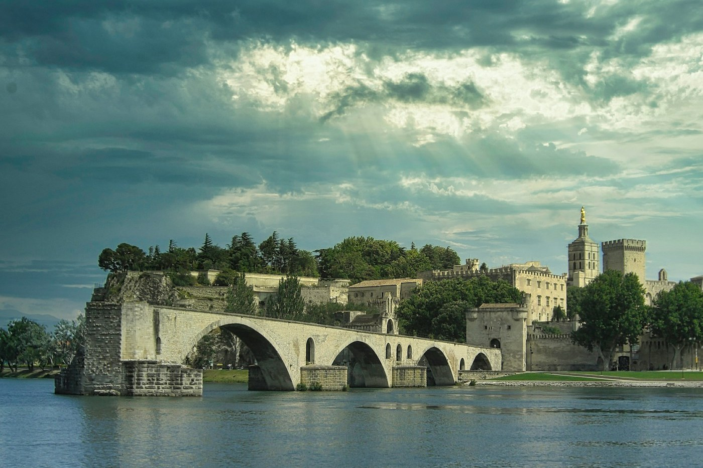
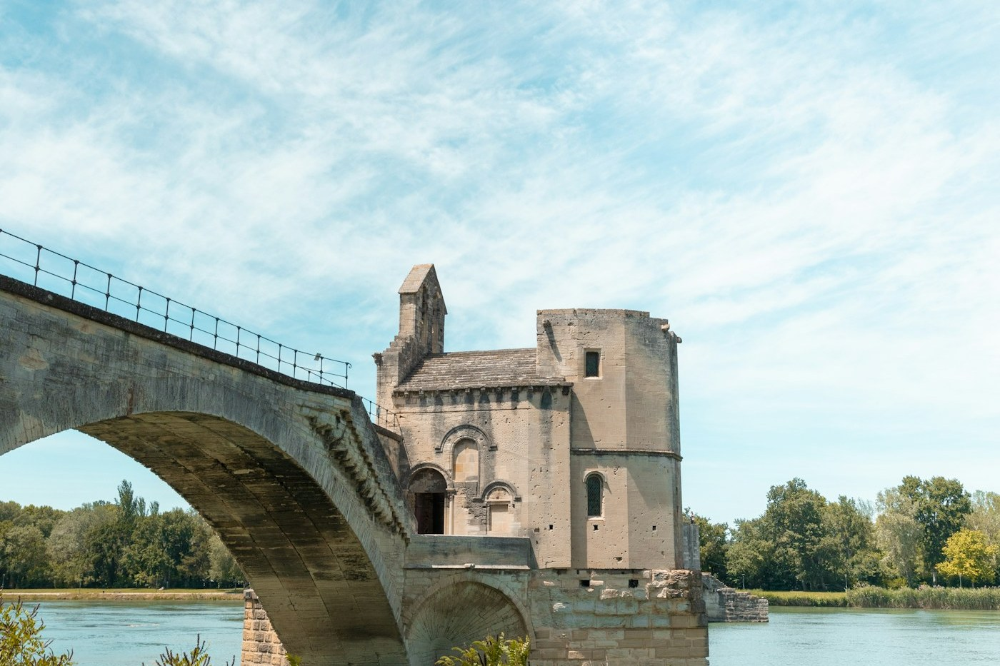

# Avignon — half a bridge

*Thursday 25 June*

{frame=box}

*Sur le pont d'Avignon, on y danse* — the bridge from the song. It goes halfway across the Rhône and stops, because the river kept knocking it down and in the 1600s they gave up. You pay to walk out to the end and stand there, and it is, genuinely, one of the better things to do with eight euros.

## The bridge

Four arches left of twenty-two. A tiny chapel on it. A wind that could take a hat, which is where the hat went, so the twice-written note in [[South of France — the plan]] was for nothing. Nobody danced. A child tried.

{frame=box}

## The palace

The Palais des Papes: the popes lived here for seventy years in the 1300s when Rome was too dangerous, and they built the biggest Gothic palace in Europe to make the point. Room after enormous room. Frescoes of hunting in the pope's bedroom, which tells you something. The audio guide is a tablet that shows you the rooms furnished; the rooms are empty; it works.

Dinner in the square below, with the theatre festival being set up all around us — the whole town is a stage in July. Left before it started. Regret, slightly.

- [x] The bridge, to the end
- [x] Lose the hat
- [x] The palace
- [ ] Buy a hat

> New rule: two hats.

---

Photos: Roelf Bruinsma, Ryan Klaus / Unsplash

#travel/south-of-france/avignon
