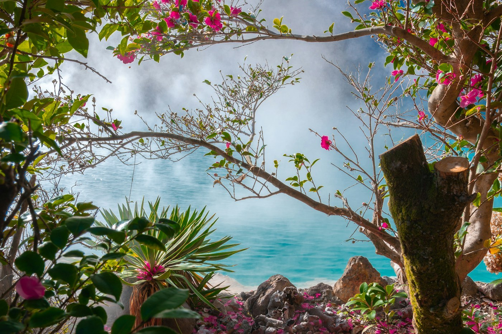

# Beppu — the hells

*Wednesday 15 – Thursday 16 April*

Last stop. A town on the coast of Kyushu where steam comes out of the ground everywhere — drains, gardens, the gap between two houses — and the locals have been sitting in it for a thousand years.

{frame=box}

## The hells

Seven hot springs too hot to bathe in, so they made them into a tour instead. One is cobalt blue. One is blood red. One is a mud pot that blurps. One has crocodiles, which felt like a decision someone made a long time ago and everyone has been too polite to reverse.

A man at the blue one boils eggs in a basket in the water and sells them for ¥100. We are, at this point, connoisseurs of eggs boiled in volcanoes, and these were the best.

## The sand bath

At Takegawara, a woman in a headscarf buries you up to the neck in black sand that is heated by the spring underneath. Ten minutes. Sweat runs into your ears. It is the most relaxed I have been since we landed, possibly since birth.

## Last day

Steamed our own dinner at a *jigoku-mushi* kitchen: you rent a basket, buy vegetables and prawns and a whole fish, and lower them into a hole in the ground where the earth cooks them for you in eight minutes. Ate it at a picnic table in the steam. Did not want to leave.

- [x] The hells (all seven, one regrettable)
- [x] Sand bath
- [x] Hell-steamed dinner
- [x] The public bath at 6 am with four old men who nodded
- [ ] Airport bus, 9:40 tomorrow. Set two alarms.

> Fourteen days. Twelve places. Something like forty eggs. See [[Japan — the budget]] for the damage, and [[Japan — the plan]] for how it started.

---

Photo: Samuel Berner / Unsplash

#travel/japan/beppu
