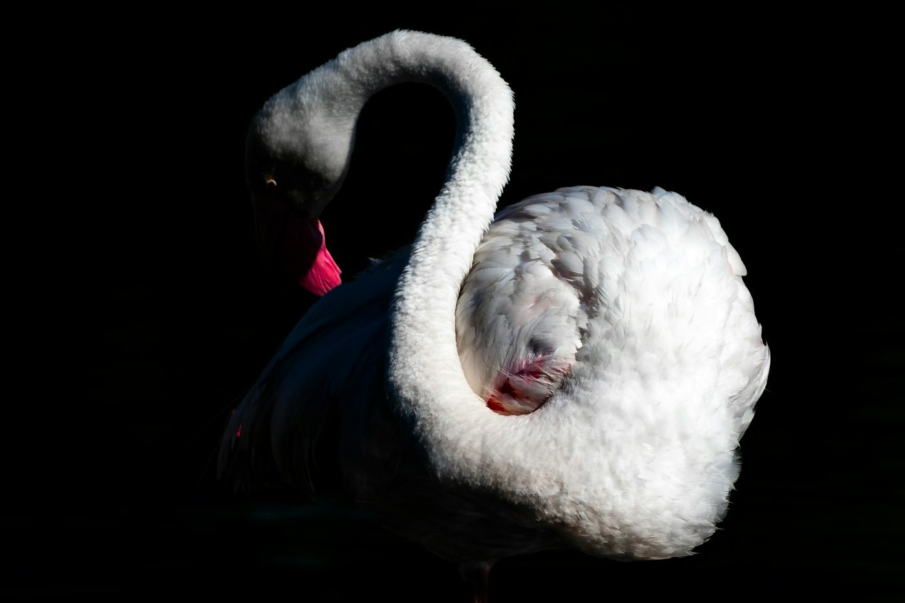
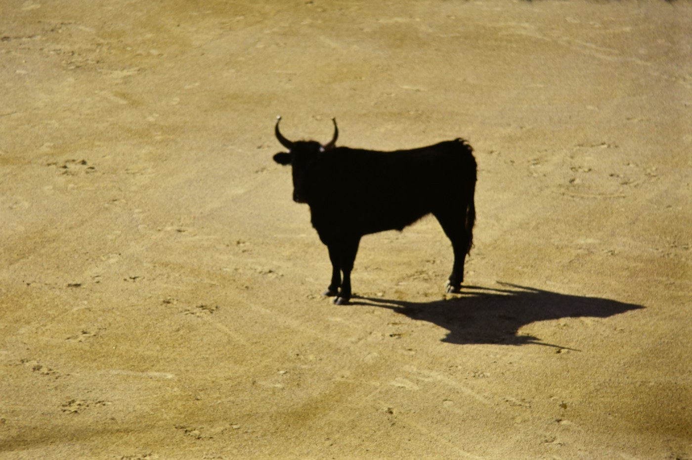

# Camargue — pink birds, white horses, black bulls

*Tuesday 23 June*

{frame=box}

Where the Rhône gives up and turns into marsh. Flat as a table, salt lagoons to the horizon, and the whole place run by three animals.

## Flamingos

Thousands of them. They are not shy. They stand in the shallows on one leg with their heads upside down in the water and honk — they honk, nobody told me they honk — and when a group takes off it is pink on pink on pink. We stood on the walkway at the bird park for an hour and I did not once look at my phone.

{frame=box}

## Horses and bulls

The white horses are born dark and turn white as they grow. The black bulls are bred for a game where nobody kills the bull and the bull mostly wins. We saw both from the car window, standing in fields of nothing, and once a man on a white horse moving twenty bulls down a road as though it was 1850, which in the Camargue it apparently still is.

## Saintes-Maries

The town at the end: a fortified church on a beach, gypsy pilgrims' saints inside, a bull ring outside, and salted caramels in the shop next door. Ate three in the car.

- [x] Flamingos (honking)
- [x] White horses, black bulls, one gardian
- [x] Saintes-Maries-de-la-Mer
- [ ] Ride a white horse on the beach — there is a stable; we were too full of caramel

> Flattest, strangest, pinkest day.

---

Photos: Matthieu Rochette, Piermario Eva / Unsplash

#travel/south-of-france/camargue
