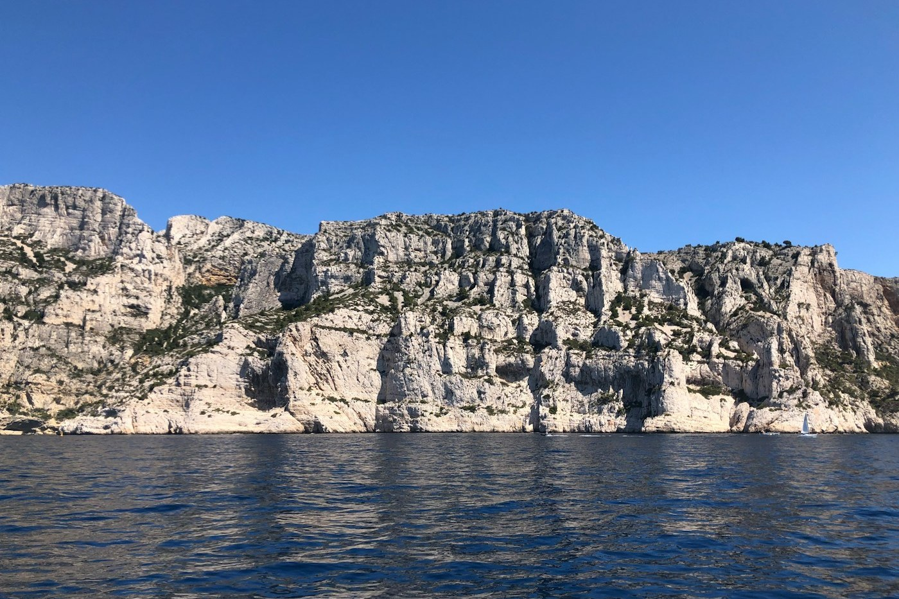
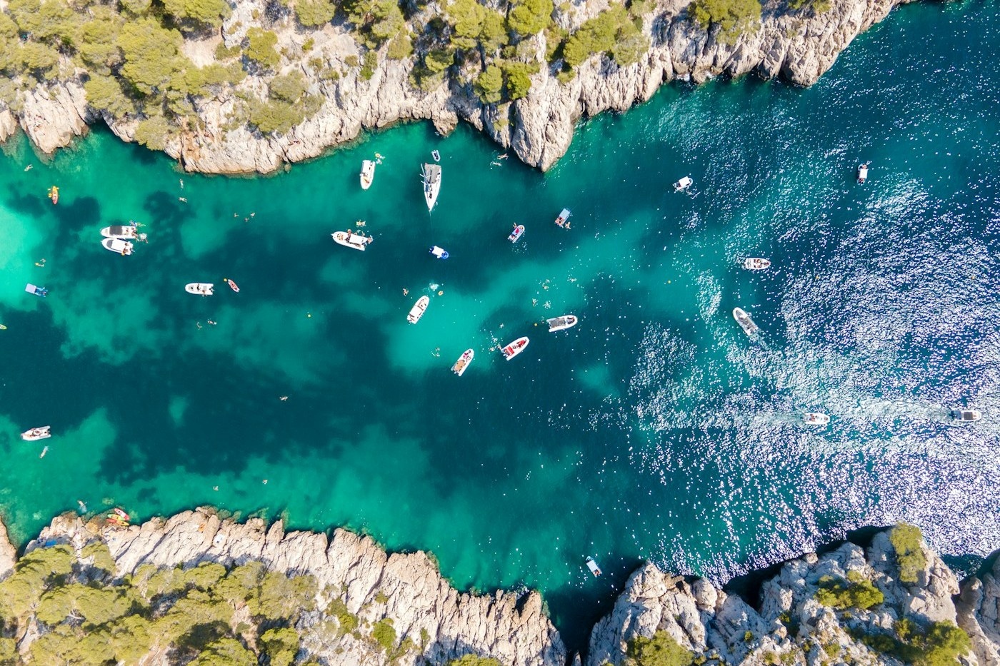

# Cassis — the calanques

*Monday 22 June*

{frame=box}

West past Marseille to a fishing port with pastel houses and a harbour full of small boats, and behind it, the calanques: limestone fjords where the cliffs are white and the water is a blue that cannot be described without sounding like an estate agent.

## The boat

The one boat of the trip. Forty minutes out of the harbour and into three calanques in turn, each narrower than the last. People swimming in the last one, from boats, from rocks, from what looked like nowhere. The water so clear you could count the stones on the bottom from the deck.

{frame=box}

## The walk

Then we walked to one anyway — Port-Miou, the first, the easy one, along a path that smelt of pine and hot rock. Swam. Cold for the first ten seconds and then the best swim of the year.

Lunch back in the port: a plate of small fried fish and a glass of the local white, which is famous, and which I had not heard of, and which I now think about.

- [x] Boat, three calanques
- [x] Swim in one
- [x] The white wine — buy a bottle for the drive
- [ ] The big walk to En-Vau — four hours, next time, with the hat

> The cliffs are so white the sea looks fake. It is not fake. I checked, with my whole body.

---

Photos: Arno Senoner, ISHM / Unsplash

#travel/south-of-france/cassis
