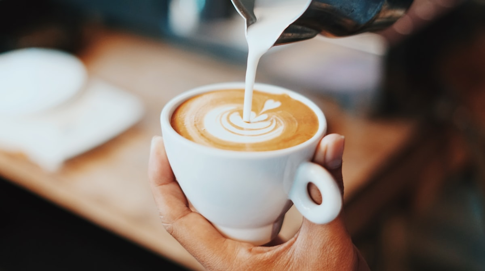
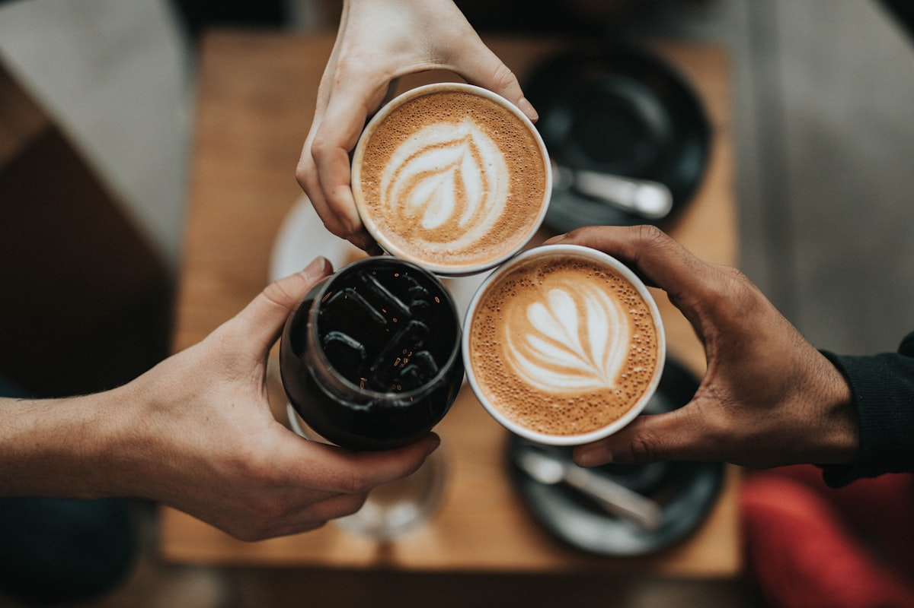

# Coffee log

{frame=tint w=520}

The tag on this note wears a cup because the app knows what coffee is. If you search for *coffee*, something else happens.

## This week

- **Mon** — Ethiopian, V60, 15 g / 250 g, 2:45. Blueberry, then a little too much acid. Grind finer.
- **Tue** — Same beans, finer. *There it is.*
- **Wed** — Flat white from the place with the four seats. See [[Letter to Mum, from Kyoto]].
- **Thu** — Instant. We do not speak of Thursday.
- **Fri** — Aeropress, inverted, 1:12. Chocolate. The weekend starts here.

## Rules of the house

> No coffee after two. Yes, even that one.

- [x] Descale the machine
- [ ] Order more filters
- [ ] Try the Colombian at 94 °C instead of 96

{frame=film w=420}

---

Photos: Fahmi Fakhrudin, Nathan Dumlao / Unsplash

#examples/coffee #coffee
