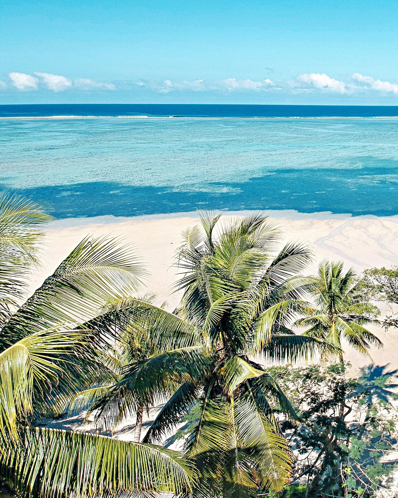
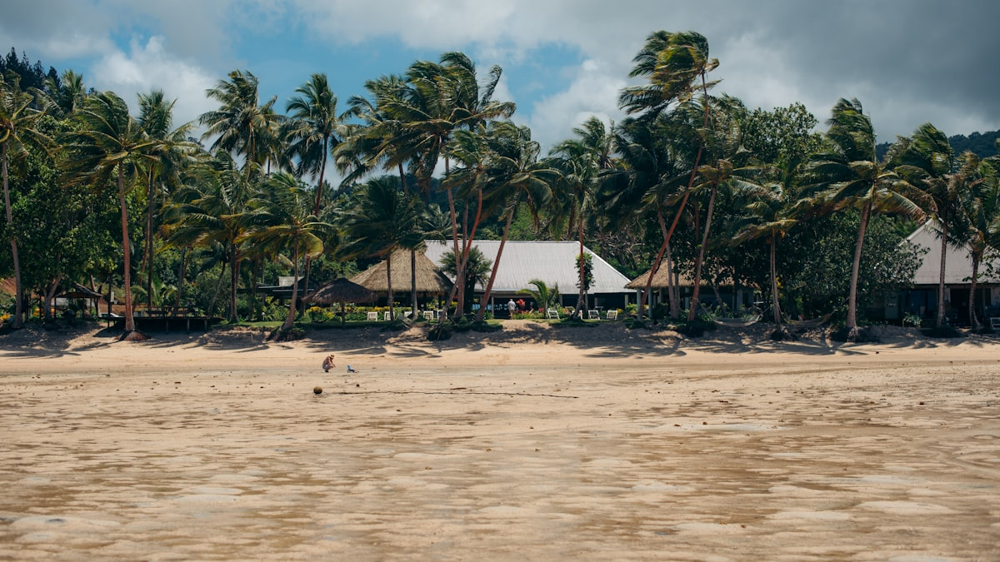

# Fiji packing list

{frame=film w=520}

Five days, one bag, no laptop. The rule is that if it doesn't fit in the bag it doesn't come, and the bag is smaller than last time on purpose.

## Bag

- [x] Passport
- [x] Reef-safe sunscreen, the big one
- [x] Two swimmers, because one is always wet
- [🦆] The inflatable duck, obviously
- [ ] Snorkel
- [ ] Paperback (something long, something silly)
- [ ] Charger, the short cable
- [ ] Hat with a brim that means it

## Before we go

- [ ] Tell the bank
- [ ] Water the fern, then ask Sam to water the fern
- [ ] Download the maps
- [x] Book the boat to the small island

{frame=print w=420}

> The small island has no wifi. This is the point of the small island.

---

Photos: Magdalena Love, Nik Schmidt / Unsplash

#examples/travel #travel/fiji
