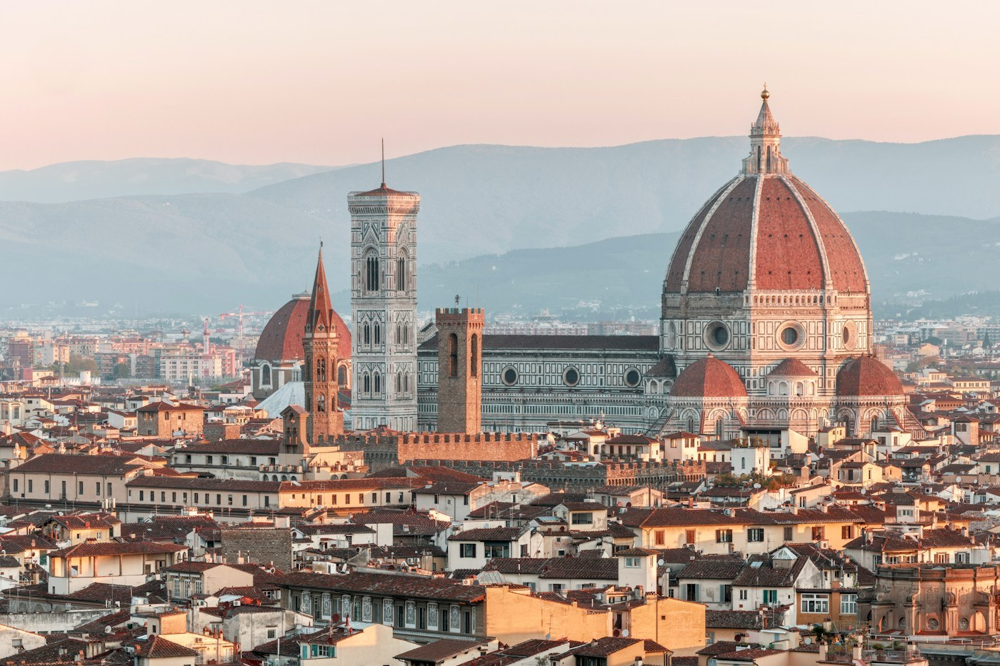
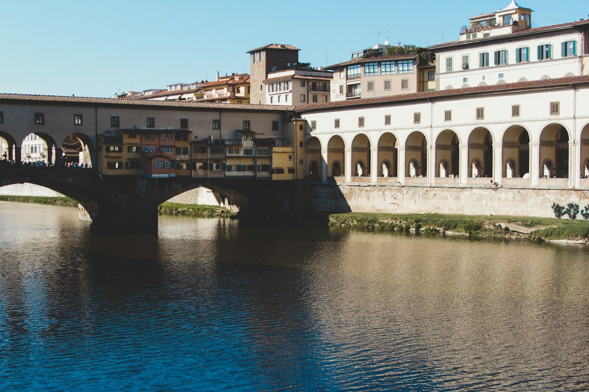

# Florence — the dome and the bridge

*Saturday 12 – Sunday 13 September*

{frame=box}

Two days, which is not enough and is also exactly enough, because on day three you would be sick of beauty.

## The dome

Brunelleschi's dome: 463 steps up between the inner and outer shells, a staircase built in 1430 for men shorter than us, and at the top the whole city in terracotta with the hills behind. The frescoes inside the dome are of hell, and you pass them at close range on the way up, which concentrates the mind.

Booked weeks ago for 8:30 and glad of it — by ten the queue for the cathedral went round the block.

{frame=box}

## The bridge

The Ponte Vecchio has had shops on it since the 1300s. Butchers, once; the Medici did not like the smell on their private corridor above, so now it is goldsmiths, and the smell is money. We walked across it at seven in the morning when it was empty and again at seven at night when it was not. Morning wins.

## Day two

The Uffizi, three hours, and then a rule: no more museums this trip. Botticelli's Venus is smaller than you think and better than you think. Lunch: a sandwich from the famous place with the queue, eaten standing in the street with everyone else, lampredotto, which is tripe, which I am not going to describe, which was excellent.

Evening on the other side of the river, Oltrarno, where the workshops are and the tourists thin out. A negroni in the square, invented here, correctly.

- [x] The dome, 463 steps
- [x] Ponte Vecchio, empty and full
- [x] Uffizi (and then no more museums)
- [x] Lampredotto, once
- [ ] The Boboli gardens — next time, with more legs

> Florence is a city that has been beautiful for so long it has stopped noticing.

---

Photos: Henrique Ferreira, Casey Lovegrove / Unsplash

#travel/tuscany/florence
