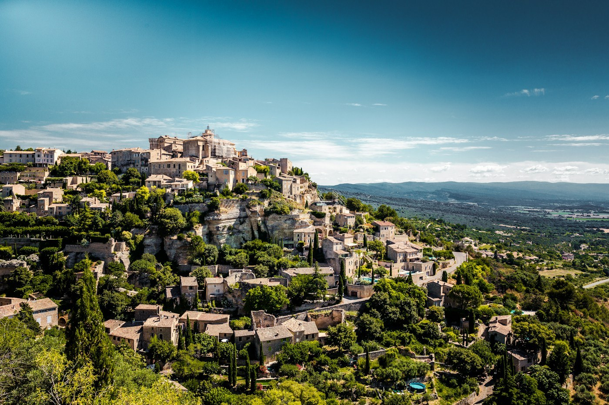
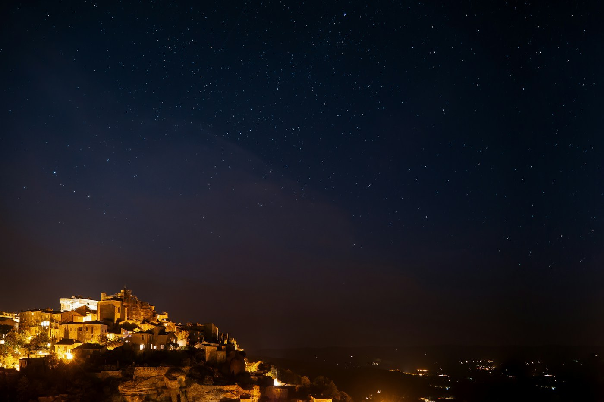

# Gordes — the village that is a postcard

*Friday 26 June*

{frame=box}

Into the Luberon, the hills behind Avignon where every village is on a rock and every rock is famous. Gordes is the most famous. You come round a bend and there it is, stone houses stacked up a cliff, and there is a lay-by exactly there because everybody stops.

## The village

Beautiful and knows it. A castle in the middle, a market on Tuesday (it was Friday), galleries selling paintings of the village to people standing in the village. We had a coffee on the terrace and looked at the view, which is the thing to do, and then walked down through the lanes where the tourists thin out and the cats begin.

{frame=box}

## The abbey

Sénanque, in the valley below: a twelfth-century Cistercian abbey with lavender fields in front of it, the picture on every box of soap in Provence. The lavender was just turning. The monks still live there; the shop sells their honey and a liqueur that tastes like a hedge and I bought two.

## The stone village

Down the road, the Village des Bories: dry-stone huts like beehives, built without mortar, lived in until the 1800s. Nobody there but us and a lizard. Best thing of the day and not on the soap box.

- [x] The lay-by view
- [x] Coffee on the terrace
- [x] Sénanque, honey, hedge liqueur
- [x] The bories
- [ ] Come back on a Tuesday for the market

> Gordes at night from the road below, lit gold, looks like a stage set. Sat in the car and looked at it for ten minutes.

---

Photos: Simon Spring, Artur Aldyrkhanov / Unsplash

#travel/south-of-france/gordes
