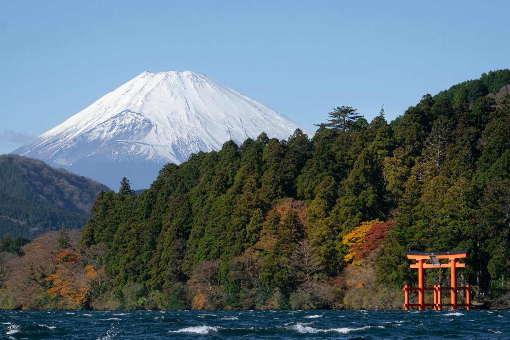
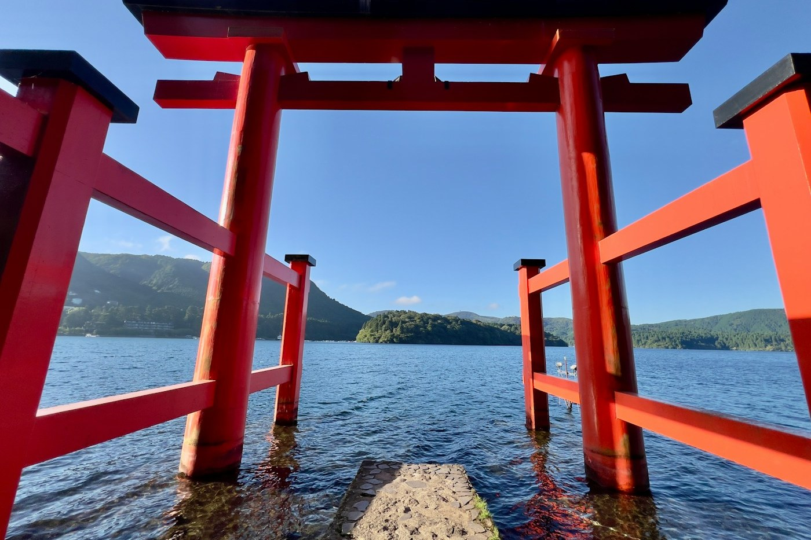

# Hakone — a torii in the lake

*Monday 6 April*

{frame=box}

Train, then a smaller train, then a cable car, then a ropeway over a valley that smells of eggs, then a boat that has been dressed up as a pirate ship for reasons nobody explained. Five vehicles to reach a lake. Every one of them was the right decision.

## Fuji

You are told you will not see Fuji. It hides. The forecast said cloud. At 2 pm the cloud simply left, like it had a train to catch, and there it was, snow on top, bigger than it has any right to be.

I took forty photos. The good one is above and I did not take it.

{frame=box}

## The gate

The torii of Hakone Shrine stands in the water with its feet wet. There is a queue to stand under it for a photo — forty minutes, orderly, quiet, self-managed with no staff in sight. We joined it, because when in Japan you join the queue.

Black eggs from Owakudani, boiled in the sulphur spring. They say each one adds seven years to your life. Ate two. Will report back in fourteen years.

- [x] See Fuji (unearned luck)
- [x] Pirate ship
- [x] Black eggs ×2
- [ ] Onsen at the ryokan — tonight, after this

> The ryokan dinner had eleven courses and a card explaining them. I understood the card for four of them.

---

Photos: Helmi Tan, Kiko K / Unsplash

#travel/japan/hakone
