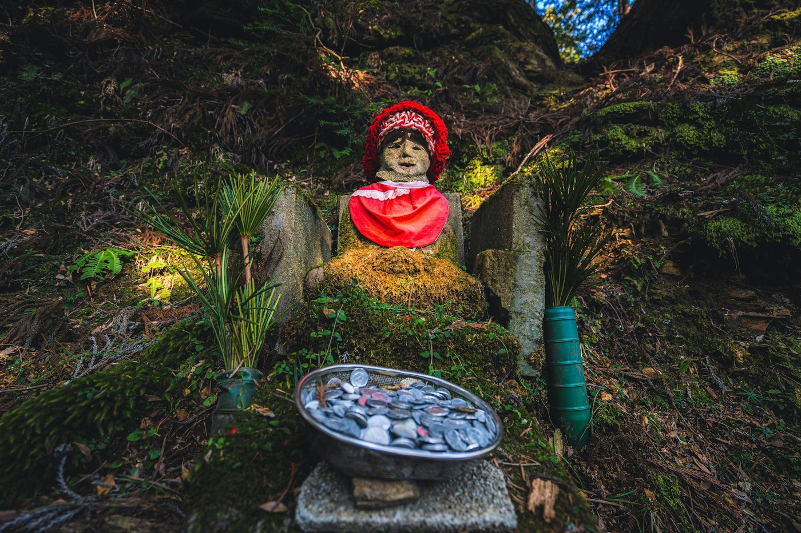
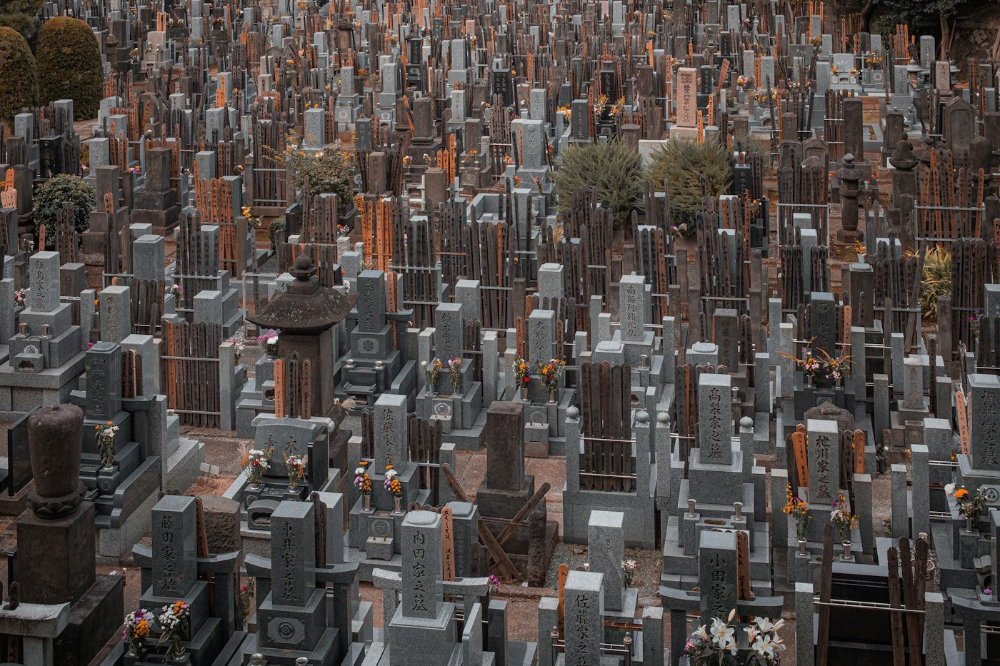

# Koyasan — a night in a temple

*Thursday 9 April*

A train that turns into a cable car that turns into a bus that climbs into cloud. At the top: a town of a hundred temples, and one of them has our names on a list.

{frame=box}

## The temple

Shojin-ryori dinner, all vegetables, served on a tray by a monk who bowed at the door and left us to work out the sesame tofu ourselves. Tatami room, futon, a paper window that lets in exactly enough of the cold to feel monastic. No lock. Nobody needs one here.

Morning prayers at 6. Incense, chanting, a fire ceremony that is louder than it sounds. I understood none of it and was moved anyway, which I suspect is the design.

## Okunoin

{frame=box}

The cemetery is two kilometres of moss and stone under cedars that were old before the graves were. Two hundred thousand graves, they say, including a rocket-shaped one for an aerospace company and one for the termites a pest-control firm has killed. Someone has put a knitted red hat on nearly every small statue. Nobody says who.

We walked it at dusk and again after prayers, and the second time was better, and it was the same path.

- [x] Temple stay
- [x] Morning fire ceremony
- [x] Okunoin, twice
- [ ] Learn what the sesame tofu was

> Silence, real silence, for the first time since we landed. My ears rang with it.

---

Photos: Alex Mesmer, Denys Nevozhai / Unsplash

#travel/japan/koyasan
