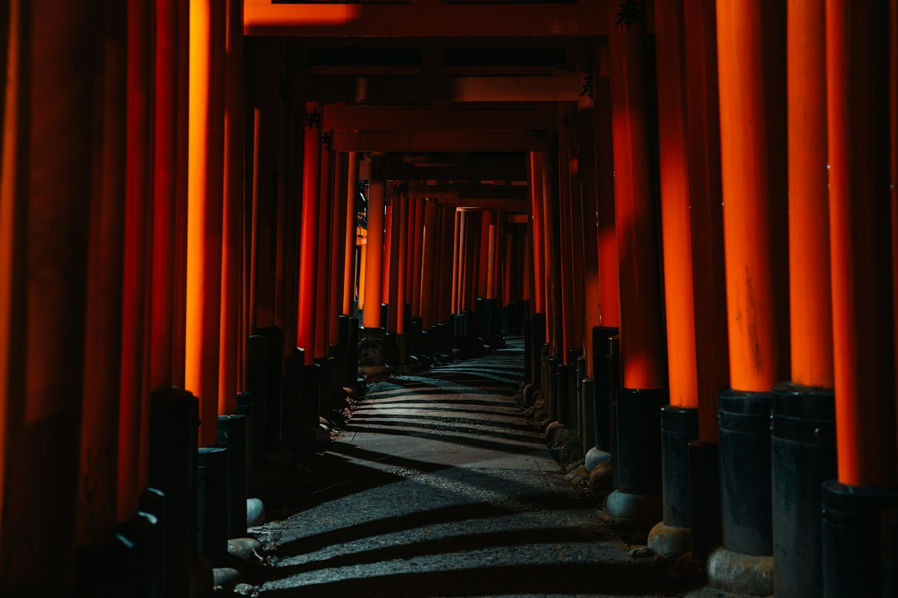

# Kyoto — Fushimi Inari before breakfast

*Tuesday 7 April*

The advice is: go at dawn. The advice is right. At 6:15 we had the gates almost to ourselves — us, a jogger, and a fox statue with a key in its mouth.

{frame=box}

## The gates

Ten thousand of them, each one paid for by a company and painted with the company's name on the back, so walking up is silence and walking down is a phone book. The colour is a shade of orange that does not exist anywhere else. The sound is your own footsteps and, further up, nobody.

It takes two hours to the top if you stop for every fox. We stopped for every fox.

## After

Coming down at 8:30 the coaches had arrived and the first stretch was a river of people. We swam against it to the station and felt smug on the train, which is not a noble feeling but is a good one.

Kyoto then did what Kyoto does: tea in a garden, a temple with a gravel sea, a covered market that sells pickles in more colours than pickles come in. Dinner near the alley from [[Kyoto, night one]] — the noodle window is still there, still one item on the menu.

- [x] Dawn gates
- [x] Every fox
- [x] Nishiki market pickles (the purple ones)
- [ ] Philosopher's Path — cherry blossom is at its peak, go tomorrow morning before Nara

> Set the alarm for 5:30 and did not resent it. This is new.

---

Photo: Sarmat Batagov / Unsplash

#travel/japan/kyoto
