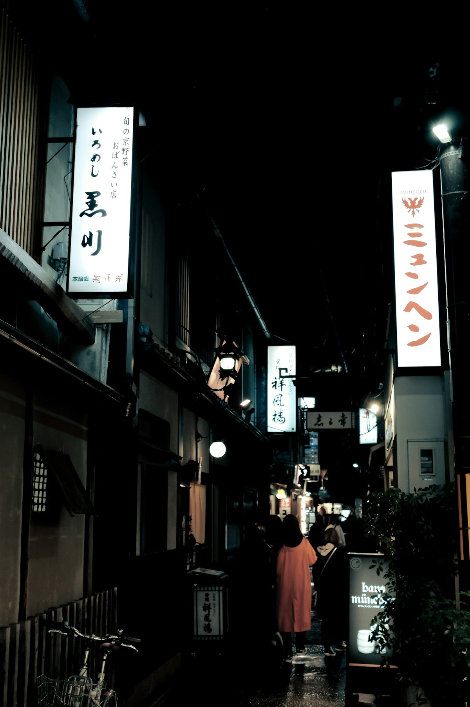
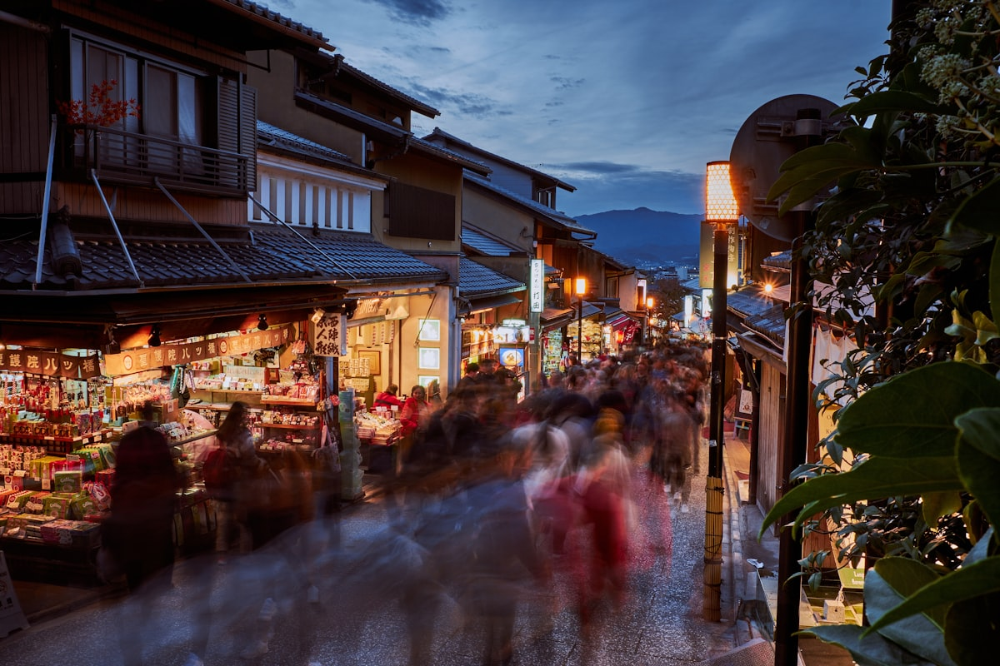

# Kyoto, night one

{frame=comic w=560}

Landed at four, lost the hotel by five, found it by six because a man on a bicycle stopped, looked at my phone, laughed, and pointed *directly behind me*.

## The alley

The lanterns come on before the sky goes dark, so for twenty minutes everything is two colours at once — blue above, orange below. I stood in the middle of the alley long enough that a woman with a shopping bag had to step around me. Sorry. Worth it.

## The lights

{frame=bezel w=520}

Dinner was noodles from a window. The window had a queue of exactly one, which was me, and a menu of exactly one, which was the noodles. Best decision-free meal of the year.

- [x] Find the hotel
- [x] Eat something from a window
- [ ] The shrine at dawn, if the alarm wins
- [ ] Buy the tea for Mum (see [[Letter to Mum, from Kyoto]])

> Note to self: the vending machine on the corner sells hot coffee in a *can*. Investigate. Possibly repeatedly.

---

Photos: Johnny Ho, CK Yeo / Unsplash

#examples/journal #travel/japan
