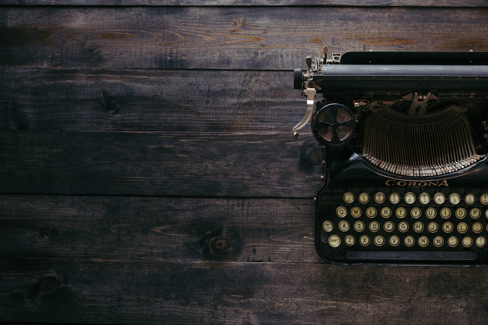
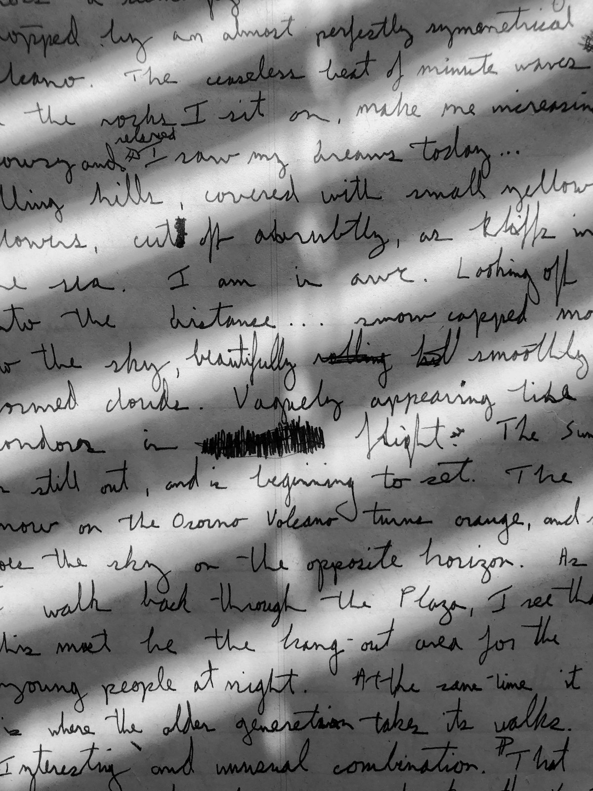

# Letter to Mum, from Kyoto

{frame=print align=right w=260}

Dear Mum,

It is **eight in the morning** and I am writing this from a café that only has four seats, all of them taken by me and my bag. The owner has given up on English and just brings things: first a coffee, then a boiled egg, then, mysteriously, a small bowl of pickles. I have eaten all of it.

Kyoto is exactly what you said it would be and nothing like it. The temples are quiet and the streets are not. Yesterday I walked for six hours and my step counter gave up before I did — see [[Kyoto, night one]] for the pictures.

> *"Wherever you go, go with all your heart."* — that was on the wall of the café, in English, which I take as a sign.

I bought you the tea. I am not telling you which one. It is the one you like.

Love,
Andrew

{frame=tint w=420}

---

Photos: Patrick Fore, Micah Boswell / Unsplash

#examples/letters #travel/japan
