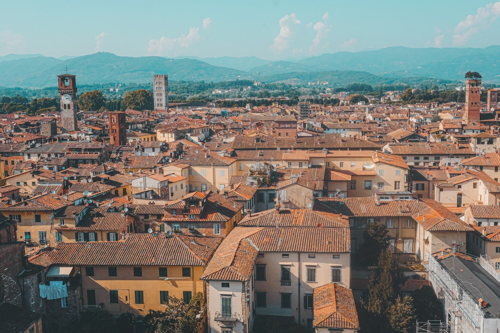
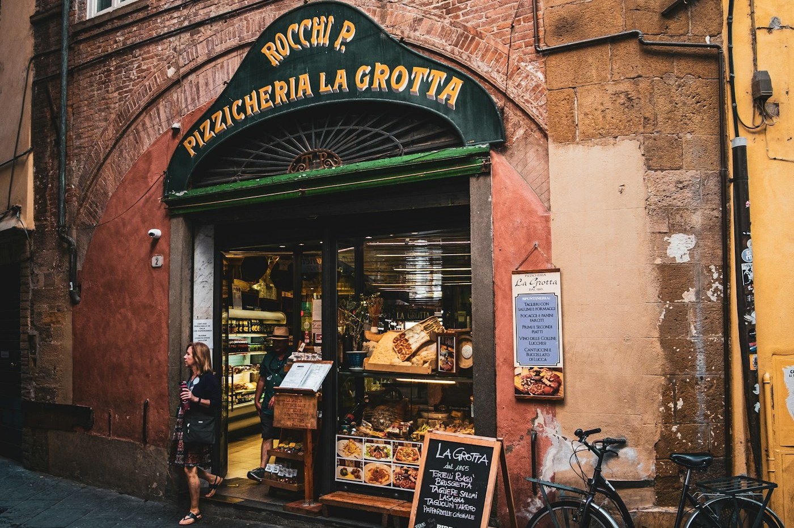

# Lucca — round the walls on a bike

*Monday 14 September*

{frame=box}

An hour west of Florence, a town still inside its Renaissance walls, all of them, four kilometres round, and the top of the wall is a park with trees on it that you cycle round.

## The walls

Hired bikes for €4 an hour from a man who did not ask for ID or a name. Round the top of the wall in twenty minutes, then round again slower, then stopped under the plane trees and watched a whole town go about its Monday below us. Nobody in Lucca is in a hurry. It is the walls; nothing gets in fast.

{frame=box}

## Inside

A piazza built inside the ring of a Roman amphitheatre, so the square is an oval and every building bends. A tower with oak trees growing on top of it, which you climb, obviously. A cathedral with a facade where no two columns match because, the story goes, the sculptors were competing. Puccini was born here and they will not let you forget it: there is a concert every night of the year. We went. It was in a church. It was too good for the price.

- [x] Bikes, twice round
- [x] The oval square
- [x] The tree tower
- [x] Puccini, nightly
- [ ] Buccellato — the sweet bread with raisins and anise; bought one, ate half in the car, note for tomorrow: eat the other half

> The best town in Tuscany that nobody insists you visit.

---

Photos: Cristina Gottardi, Charles Büchler / Unsplash

#travel/tuscany/lucca
