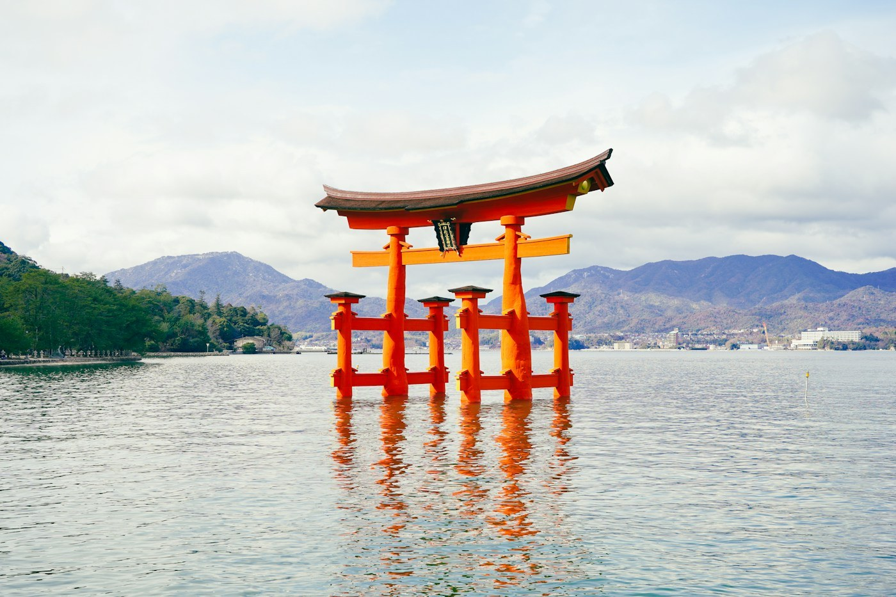
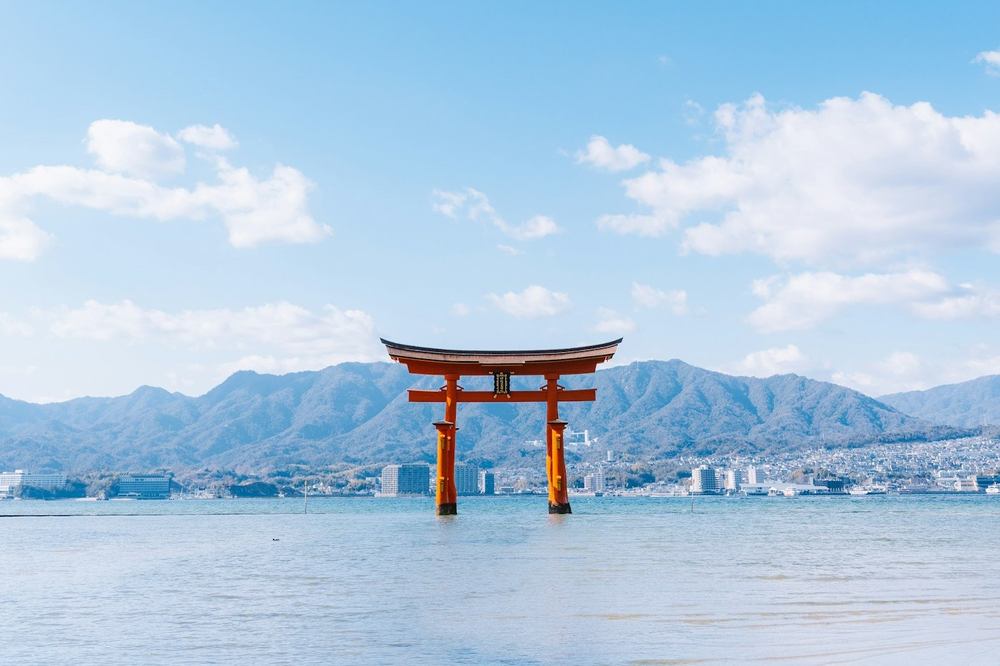

# Miyajima — the gate in the sea

*Sunday 12 April*

Hiroshima first, in the morning, which I am not going to write about here except to say: go, and be quiet, and the paper cranes will get you.

Then the ferry to Miyajima, and the gate.

{frame=box}

## The tide

The torii stands in the sea, vermilion, huge, apparently floating, and everyone has seen a picture of it and it does not matter. At high tide it floats. At low tide you can walk out across the wet sand and stand under it and put your hand on wood that has been standing in salt water since the 1870s.

We did both. Four hours apart, same gate, two different places.

{frame=box}

## Also on the island

More deer, less organised than [[Nara — the deer that bow]]. Momiji manju — maple-leaf cakes filled with red bean, hot from the machine that makes them in the window. A ropeway up Mount Misen and a walk down that we underestimated by about an hour and a lot of stairs.

Oysters grilled on the street, ¥400 each, the size of a fist.

- [x] Gate at high tide
- [x] Gate at low tide
- [x] Misen — up by ropeway, down by knees
- [x] Oysters ×4
- [ ] Come back and stay the night; the day-trippers leave at five and the island is apparently a different place

> Wrote the postcard to Mum sitting on the sea wall with the gate going orange in the sunset. She will want the deer story.

---

Photos: Zion C, PJH / Unsplash

#travel/japan/miyajima
