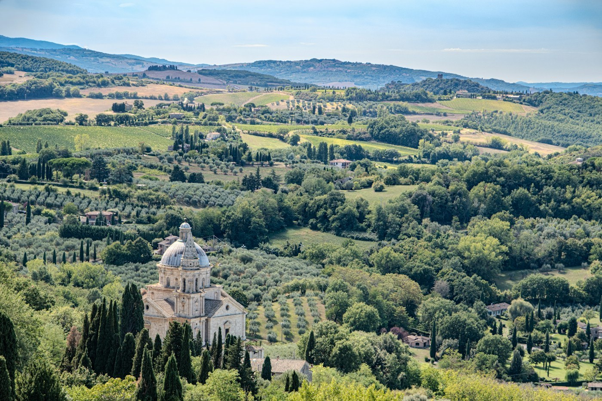
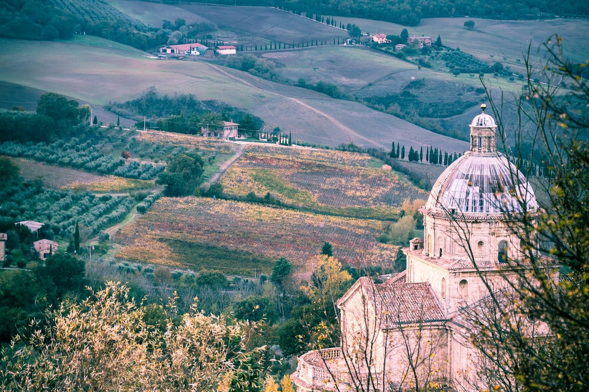

# Montepulciano — wine in a cellar under a church

*Sunday 20 September*

{frame=box}

A hill town so steep the main street is called the Corso and is a climb. At the top, the square where they filmed a vampire film that nobody here will discuss. Below, in the fields, a church on its own that is the most perfect building of the trip and gets no crowds at all because it is a fifteen-minute walk downhill and everyone is tired.

## The wine

Vino Nobile. The town is built on cellars — under the palazzi, under the shops, under, in one case, a church — and every cellar will give you a glass. We did a tasting in one where the barrels sit between Etruscan tombs and the guide said "and this is where the vampires were" and then, seeing our faces, "the film, the film". Bought three bottles. The car is now wine, garlic and a buccellato.

{frame=box}

## San Biagio

Walk down the cypress avenue to it. Honey-coloured stone, a Greek cross, a dome, one bell tower finished and one never started. Inside: cool, empty, a single old man with a broom who nodded. We sat on the wall outside for half an hour with the town above and the valley below and were not sure we needed to go anywhere else, ever.

## Dinner

Pici again, this time with the ragù of wild boar, at a place on the Corso with a terrace hanging over the drop. A glass of the Nobile. The lights of Pienza across the valley.

- [x] Cellar tasting, with tombs
- [x] San Biagio, sat on the wall
- [x] Three bottles
- [ ] The Corso again, from the bottom, at 6 am, before the legs remember

> The steepest town, the flattest church, the best glass.

---

Photos: Sue Winston, Richard Hedrick / Unsplash

#travel/tuscany/montepulciano
