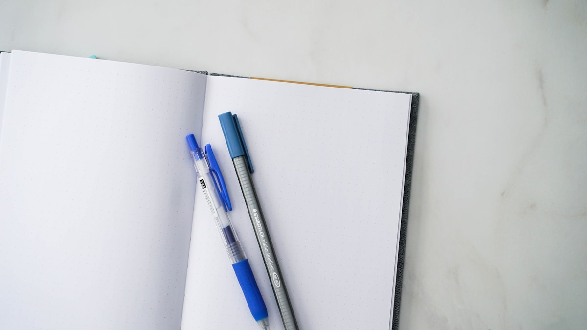

# Morning pages

{frame=print align=left w=260}

Three pages, longhand, before the phone. That is the rule and I have kept it for **eleven days**, which is a record, and I am writing that down so it counts.

Today's pages were mostly about the ~~broken~~ *temperamental* boiler, the walk I did not take, and a list of names for a cat we do not have. (Shortlist: Parsnip, Admiral, Dave.)

What I notice, reading back: the first page is always complaints, the second is always plans, and the third — if I get there — is where the actual idea lives. So the trick is to keep going past the plans.

{frame=box w=420}

> The idea today: the cabin book. Not a novel, a *record*. Start with [[The cabin weekend]].

---

Photos: Ryunosuke Kikuno, 2H Media / Unsplash

#examples/journal #journal
