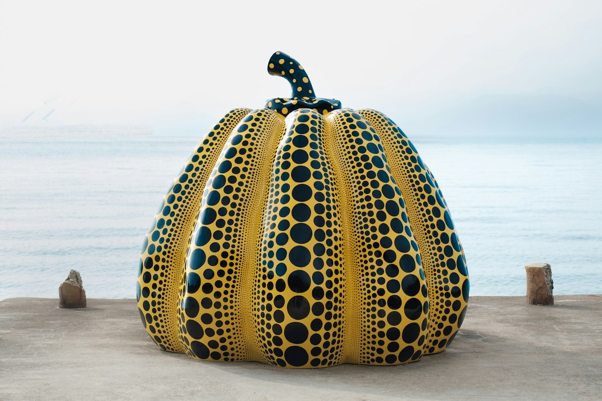
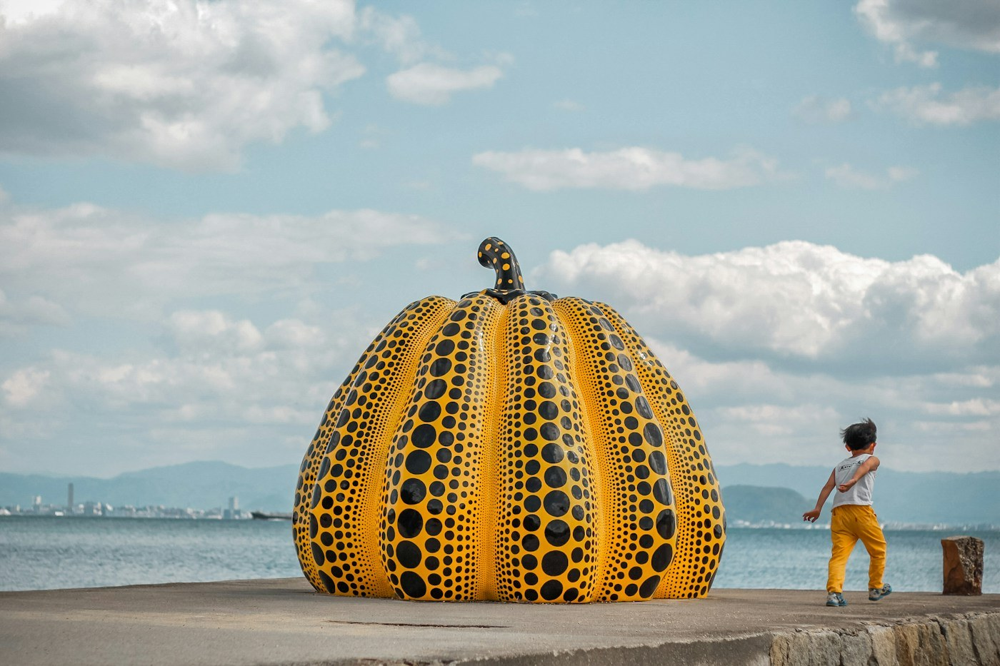

# Naoshima — the art island

*Saturday 11 April*

An island in the Inland Sea where a tyre company decided, decades ago, to fill the place with art. Ferry from Uno, twenty minutes, and the first thing you see from the water is a pumpkin.

{frame=box}

## The pumpkin

Yellow, spotted, the size of a car, on the end of a pier, staring at the sea. It blew into the water in a typhoon a few years ago and they fished it out and made a new one. People walk to it, touch it, photograph it, and then just stand there. I stood there. It is a very good pumpkin.

## The museums

Chichu is underground — you walk down into concrete and light, and there is a room of Monet water lilies you see in daylight from a skylight, and a James Turrell room where you sit and stare at what you think is a blue screen until you realise it is a hole into the sky. No photos allowed. Best thing I have seen this year, and I have no picture of it, and I think that is why.

The Art House Project: old houses in the fishing village turned into single artworks. One is a dark room with a pool of water you cannot see until your eyes adjust, which takes about ten minutes, and everyone waits together in the dark, not talking.

{frame=box}

## Getting around

Rented bicycles, ¥500 a day. Hills. Regret. Views. Worth it.

- [x] Pumpkin
- [x] Chichu (book ahead, they mean it)
- [x] Art houses — 4 of 7
- [ ] The bath house that is also an artwork; we ran out of day

> A whole island where the rule is *look slowly*. Ships in the distance, and no hurry anywhere.

---

Photos: Rahil Chadha, Yue-Ting Lin / Unsplash

#travel/japan/naoshima
