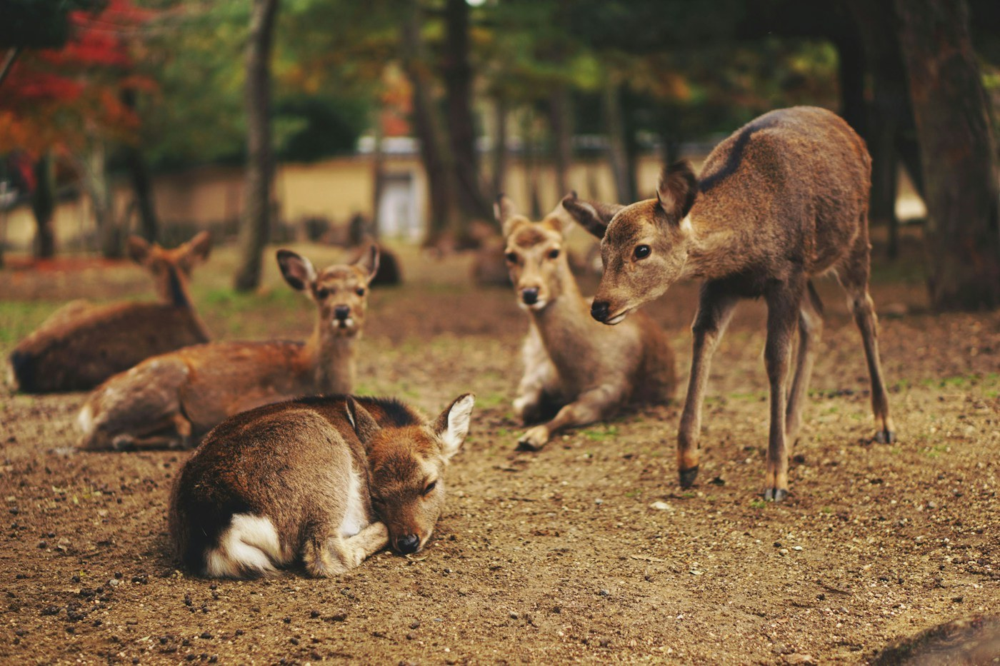
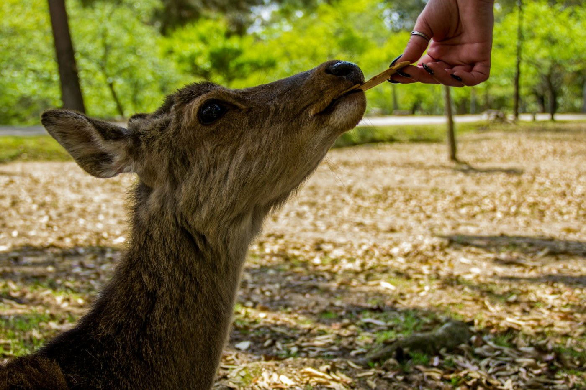

# Nara — the deer that bow

*Wednesday 8 April*

{frame=box}

An hour from Kyoto is a city where a thousand deer are sacred, know it, and have organised.

## The bowing

You buy a packet of crackers for ¥200 from a woman the deer leave entirely alone (a treaty, clearly). You hold one up. The deer bows. You bow back, because what else are you going to do. Then the deer takes the cracker, and the next deer bows, and the one behind that has already started on the map in your back pocket.

{frame=box}

I lost the map. I regret nothing.

## The big Buddha

Todai-ji has a bronze Buddha fifteen metres tall in a hall that is the largest wooden building in the world, and the strange part is how quiet it makes everyone. Even the school groups. There is a pillar with a hole in it the size of the Buddha's nostril; crawl through and you are guaranteed enlightenment. A child did it in four seconds. I did not attempt it and will therefore remain as I am.

- [x] Bow to a deer
- [x] Be bowed at by a deer
- [x] Big Buddha
- [ ] Kakinoha-zushi — sushi wrapped in persimmon leaves, buy a box for the train tomorrow

> Best ¥200 I will spend on this trip.

---

Photos: Carl Flor, Alessio Ferretti / Unsplash

#travel/japan/nara
