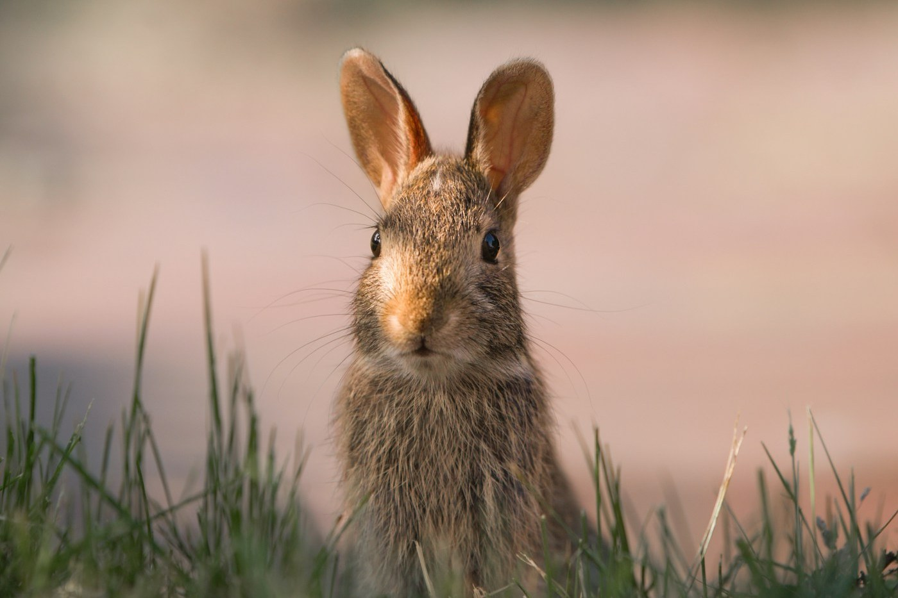
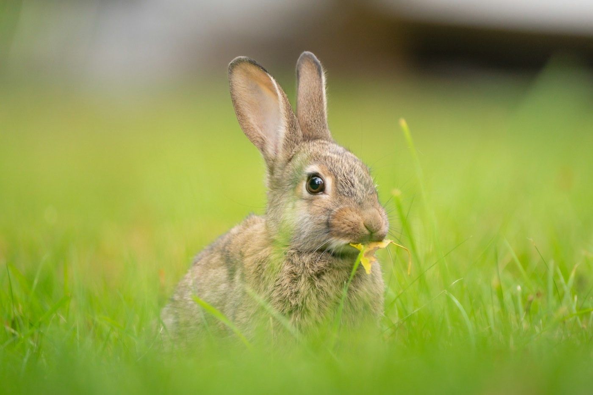

# Okunoshima — rabbit island

*Monday 13 April*

There is an island in the Inland Sea with no cars, one hotel, the ruins of a poison-gas factory nobody talked about for fifty years, and about a thousand rabbits. You can only take one of those things home with you, and it is not the rabbit.

{frame=box}

## The rabbits

They meet the ferry. That is not a figure of speech: you walk off the boat and they are on the ramp, ears up, checking whether you brought anything. We had brought a bag of cabbage and carrot from a supermarket in Tadanoumi, because the internet said to, and the internet was right.

Within a minute I had six rabbits on my shoes. One climbed onto my knee when I crouched and ate the whole bit of carrot looking me in the eye, like I owed it. I did.

{frame=box}

## The other island

The museum about the gas factory is small and honest and terrible, and you should go in, and then you come out into the sun and there is a rabbit sitting in the doorway. That contrast is the whole island, really.

Walked the loop path in two hours. Ruins with rabbits in them. A beach with rabbits on it. A lighthouse, and yes.

- [x] Cabbage: 1 (gone in 20 minutes)
- [x] Rabbit on knee
- [x] The museum
- [ ] Wash the trousers

> Strangest, happiest day. Nobody at home is going to believe this one.

---

Photos: Taylor Flowe, Ronan Hello / Unsplash

#travel/japan/okunoshima
