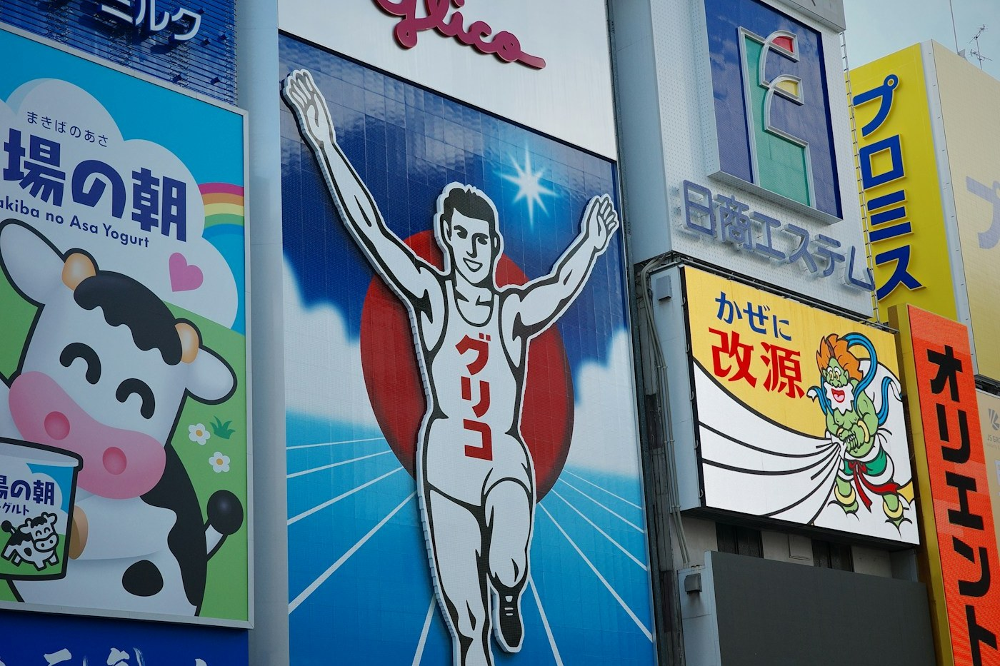
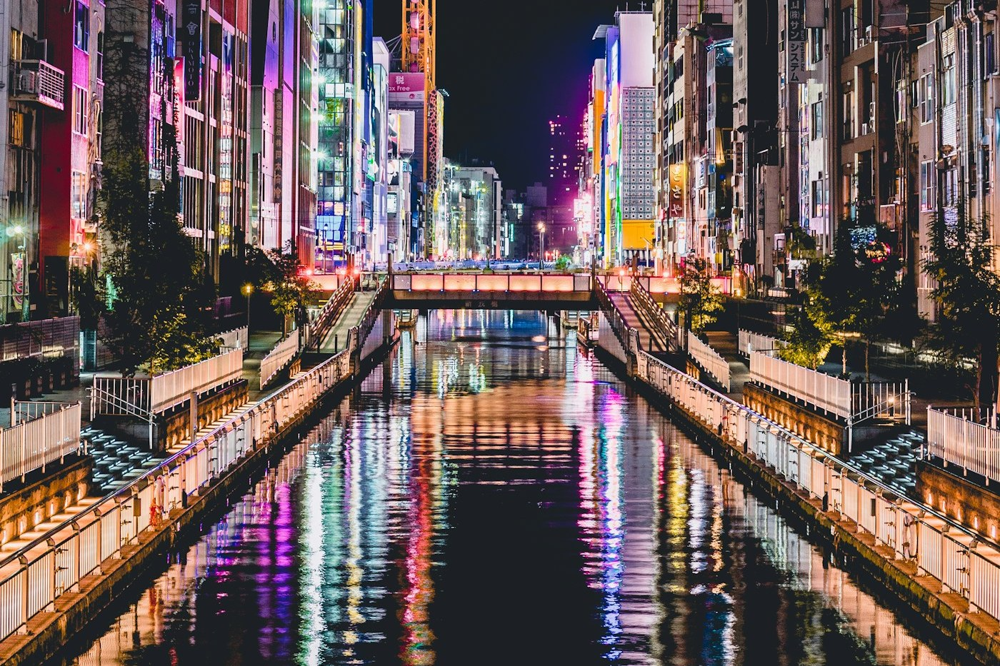

# Osaka — Dotonbori, running man

*Friday 10 April*

From a mountain temple to this in four hours. Osaka does not do quiet. Osaka does *takoyaki*.

{frame=box}

## The sign

Everyone photographs the Glico man. He has been running on that wall since 1935 and has never once looked tired. We stood on the bridge with three hundred people doing the same pose and it was, honestly, joyful.

## Eating

Osaka's motto is *kuidaore*: eat until you drop. We took this as instruction.

- Takoyaki from the stand with the longest queue: molten inside, ¥600 for eight, burnt my tongue on the first one and the seventh.
- Okonomiyaki cooked on the counter in front of us; the man drew a face in the mayonnaise.
- Kushikatsu in Shinsekai. The sign says NO DOUBLE DIPPING in four languages. We did not double dip.

{frame=box}

## Later

A side street off the canal, all lanterns and taxis, quieter by one whole decibel. A bar that only plays jazz on vinyl and only serves highballs. The owner asked where we were from and then put on a record he said we would like. He was right.

- [x] Glico pose
- [x] Takoyaki, okonomiyaki, kushikatsu — the trinity
- [ ] Do not eat tomorrow until at least noon

> Tokyo is a city that is impressive. Osaka is a city that is *fun*.

---

Photos: Pesce Huang, Redd Francisco / Unsplash

#travel/japan/osaka
