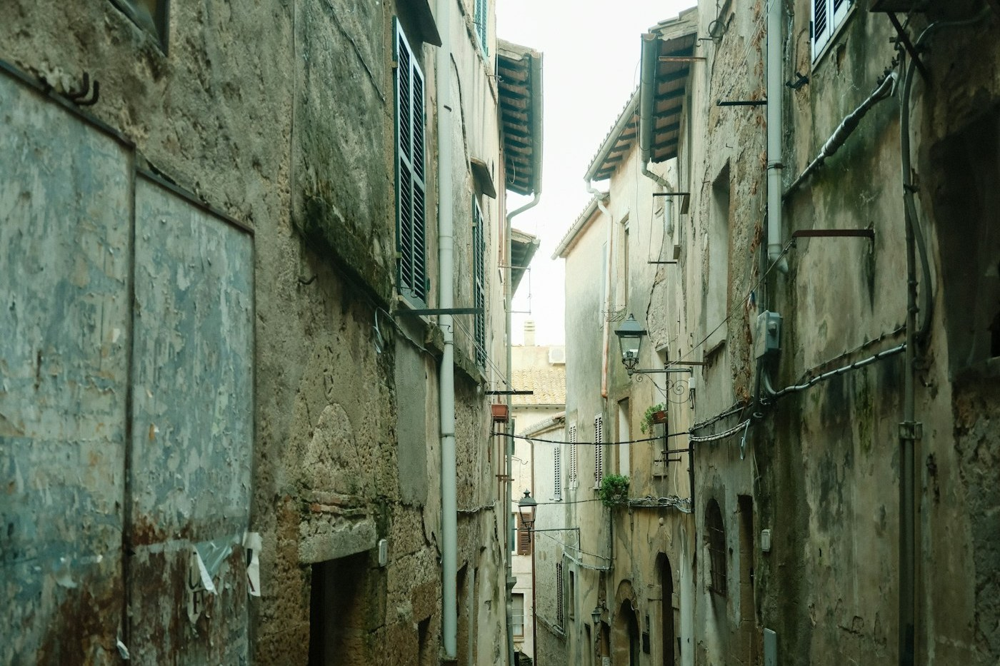

# Pitigliano — the town on the cliff

*Monday 21 September*

{frame=box}

The far south of Tuscany, where the guidebooks stop. Pitigliano is carved out of a cliff of tufa — soft volcanic rock — and the houses grow straight up out of it, so from the road across the gorge you cannot tell where the cliff ends and the town starts. It is the same colour. It has always been the same colour.

## The town

Lanes the width of a person, stairs that go into caves, caves that go into cellars, cellars that go under other houses. Half the town is underground. The Etruscans cut roads through the tufa here two and a half thousand years ago — the *vie cave* — sunken lanes twenty metres deep and a few metres wide, and you can walk one out of town into the woods and it is silent and green and slightly frightening and very good.

## Little Jerusalem

For four hundred years there was a Jewish quarter here, a synagogue, a kosher butcher, a bakery — a whole community on a cliff in the middle of nowhere, tolerated when nobody else would. The synagogue is restored and you can go in. The bakery is still a bakery. We bought the *sfratto*, a stick of honey-and-walnut pastry, whose name means "eviction", after the order that sent them here. Ate it on the wall over the gorge.

## The last dinner

A trattoria in a cave (naturally) that did *acquacotta*, the poor soup of the region: bread, egg, vegetables, whatever there was. Whatever there was, was excellent. A last glass of something local and red.

- [x] The vie cave
- [x] Little Jerusalem, the sfratto
- [x] Dinner in a cave
- [x] Look at the town from across the gorge at night — it floats
- [ ] Sovana and Sorano, the two other tufa towns — tomorrow's train said no

> Ten days, eight places, three bottles, one hat left. See [[Tuscany — the budget]] for the damage, and [[Tuscany — the plan]] for how it started.

---

Photo: Richard Vanlerberghe / Unsplash

#travel/tuscany/pitigliano
