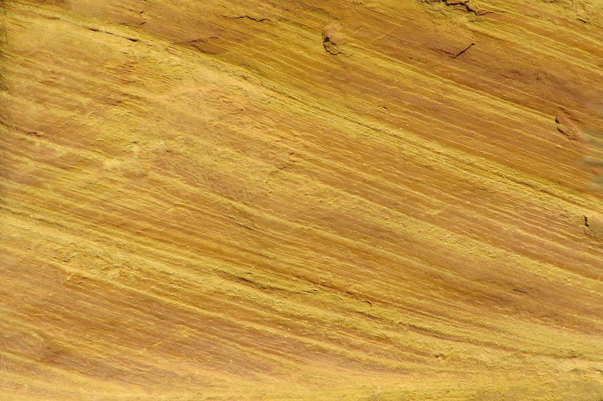
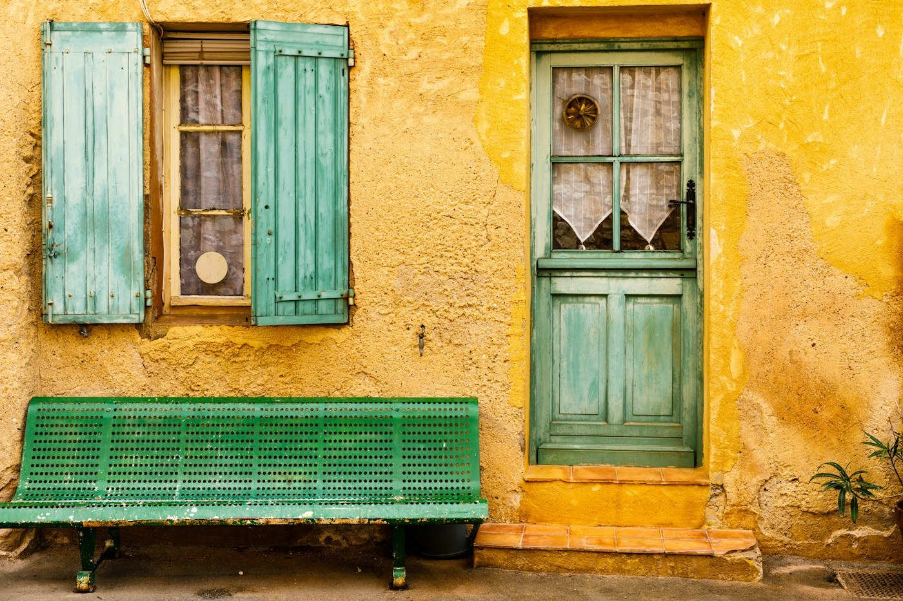

# Roussillon — the ochre

*Saturday 27 June*

{frame=box}

Ten minutes from Gordes and a different planet. Roussillon sits on a hill of ochre — the pigment — and the whole village is painted with it, every wall a different red or orange or yellow, and behind the village the old quarries are a canyon the colour of a sunset.

## The ochre trail

A path through the old quarry, forty minutes, no shoes you care about. The cliffs are seventeen shades of orange, they say; I counted eleven and gave up. Pine trees on top. Sand underfoot that stains your socks for good. A child at the end was entirely orange from the knees down and very happy.

{frame=box}

## The village

Every door is painted a colour that fights the wall it is in and wins. Green doors, blue shutters, walls the colour of paprika. We bought a small jar of pigment from the old factory for no reason at all. It is in the car with the garlic.

Lunch: a tart of tomatoes and a salad, on a terrace, looking down at the red cliffs, in the heat, half asleep.

- [x] The ochre trail (orange socks)
- [x] The pigment factory
- [x] The tomato tart
- [ ] The second, longer trail — 35 degrees said no

> Everywhere else in Provence is beige and blue. This place is on fire.

---

Photos: Arnaud Civray, Henri Picot / Unsplash

#travel/south-of-france/roussillon
