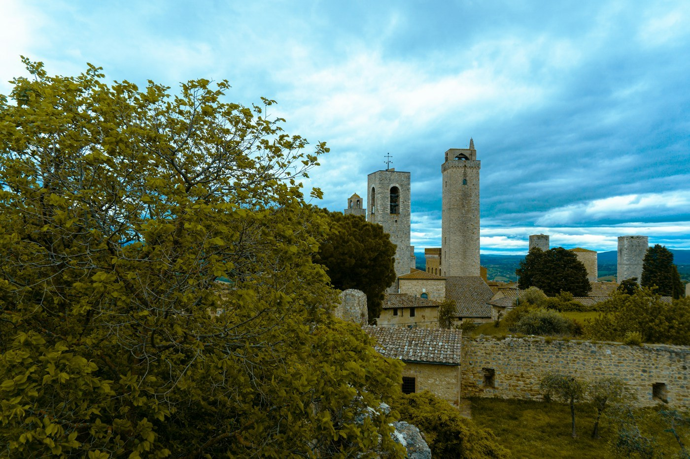
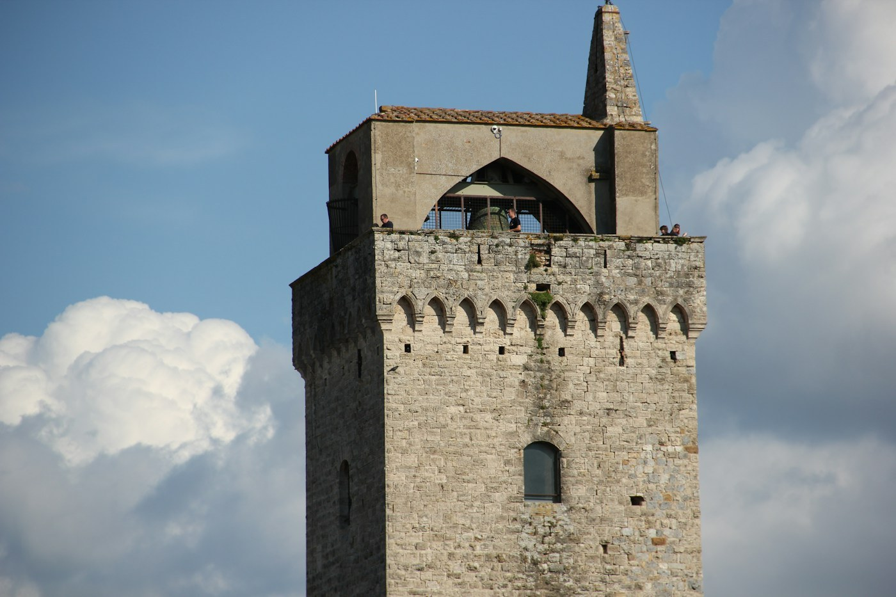

# San Gimignano — the towers

*Wednesday 16 September*

{frame=box}

Medieval Manhattan, the guidebook says, and for once the guidebook is not exaggerating. In the 1300s the families of this small town competed by building towers, taller and taller, seventy-two of them. Fourteen are left and from the road they look like a skyline.

## The towers

You can climb one — the Torre Grossa, the town hall's, 54 metres, the tallest — and look down on the others and at the countryside going out in every direction in green and gold stripes. Up there we could see Volterra on its ridge, yesterday, from today.

{frame=box}

## The ice cream

There is a gelateria in the main square that has won the world championship (there is a world championship) and the queue is thirty deep all day, and it is worth it, and the saffron and pine nut flavour is the reason. Saffron is the town's other thing, grown here since the towers. Ate it on the steps of the well in the middle of the square like everyone else, in the sun, watching the queue.

## After the coaches

At five the coaches leave and the town is suddenly a town. We stayed for that. Dinner on a terrace outside the walls with the towers going pink, and a bottle of the local white, Vernaccia, which Dante mentions, which is a good enough reason.

- [x] Torre Grossa
- [x] The champion gelato — saffron
- [x] Stay past five
- [x] Vernaccia, because Dante
- [ ] The torture museum — no; there is one in every Tuscan town and they are all the same one

> Fourteen towers, one ice cream, both worth the queue.

---

Photos: Fabrizzio Moncada, Shalev Cohen / Unsplash

#travel/tuscany/san-gimignano
