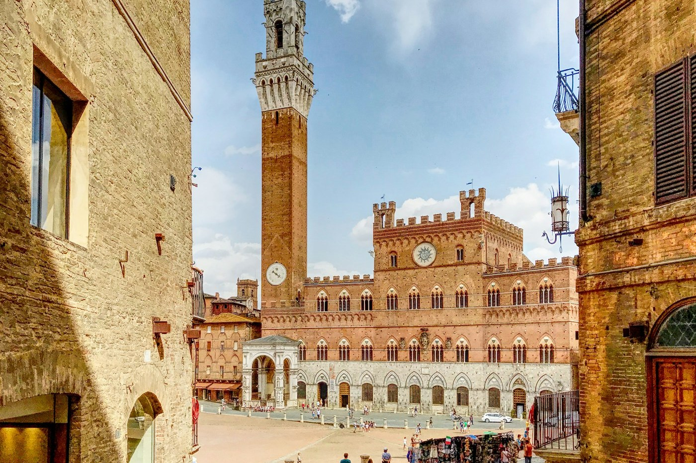

# Siena — the shell-shaped square

*Thursday 17 September*

{frame=box}

The square is the thing. The Campo is a great sloping shell of brick with a tower at the low end and the whole town tilted towards it, and twice a summer they run horses round it bareback for ninety seconds and the losers cry for a year.

## The Campo

We missed the Palio by a month and were told so, kindly, by everyone. But the square is still the square: you sit on the warm brick with your back to the sun and the tower in front of you and the shadow of the tower moves round the shell like a sundial, and eventually you get up because you have to eat.

## The tower

The Torre del Mangia, named after a bell-ringer who spent all his wages on food. Four hundred steps, narrow, one way, and a bell at the top. From the top the cathedral looks like a zebra — it is striped, black and white marble, all of it, inside too.

## The cathedral

Inside: a floor made of pictures in inlaid marble, uncovered only a few weeks a year, and this was one of the weeks. A library painted so brightly it looks new. And the plan of a nave they started in 1339 that would have made this the biggest church in the world, and then the plague came, and they stopped, and the unfinished wall is still there with the sky through the windows.

- [x] Sit in the Campo, for a long time
- [x] The tower
- [x] The floor (lucky)
- [x] Pici — the fat hand-rolled pasta, with the garlic sauce
- [ ] The Palio, one July, with a flag and a neighbourhood to cry for

> Siena lost the race with Florence 500 years ago and has been the better place to sit ever since.

---

Photo: Antonio Ristallo / Unsplash

#travel/tuscany/siena
