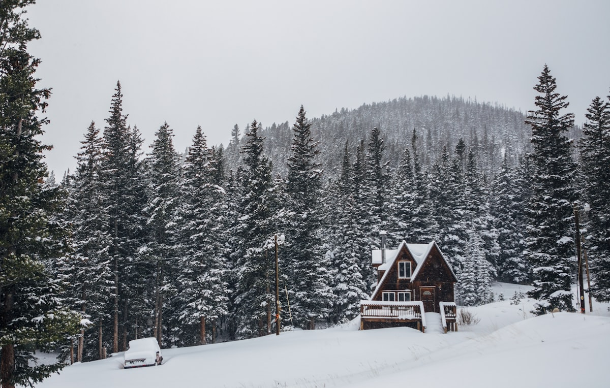
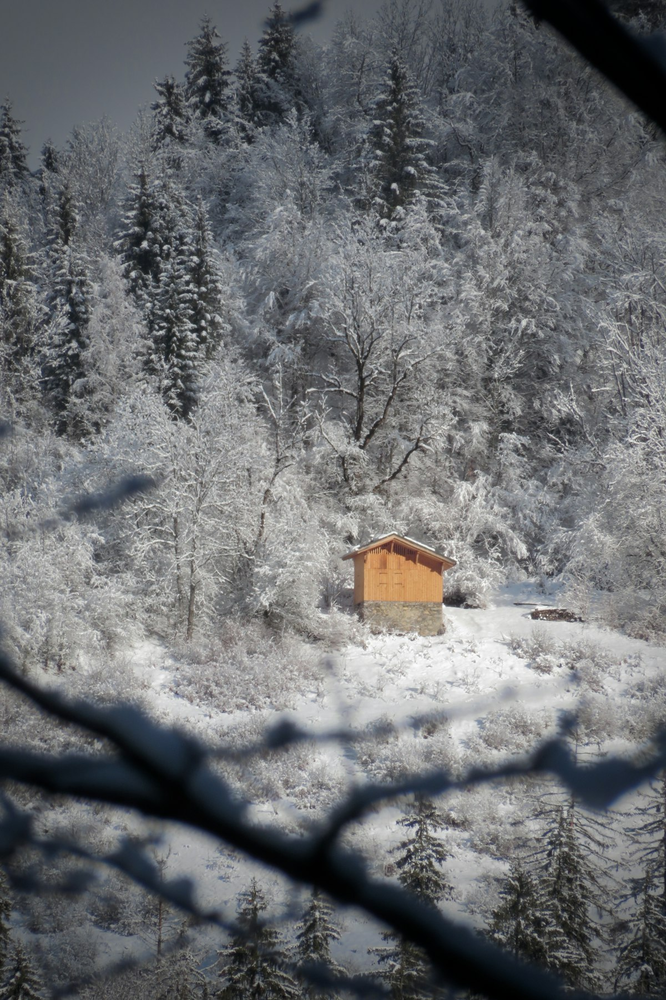

# The cabin weekend

{frame=box w=560}

## Friday

We arrived after dark and the snow had that squeak it only has when it is properly cold. The cabin took forty minutes to warm up and we spent all forty of them in coats, drinking the wine we had meant to save.

## Saturday

Nothing. Gloriously, deliberately nothing. Michelle read a whole book. I split wood badly and then well. There was soup.

---

## Sunday

{frame=dither w=520}

Walked to the ridge. The trees up there are so weighted with snow that the whole forest leans, like it is listening for something. Came back with wet socks and no photographs that do it justice — this one is close.

**Things to bring next time:** a second axe, better socks, the same wine.

---

Photos: Greg Althoff, C S / Unsplash

#examples/journal #travel
