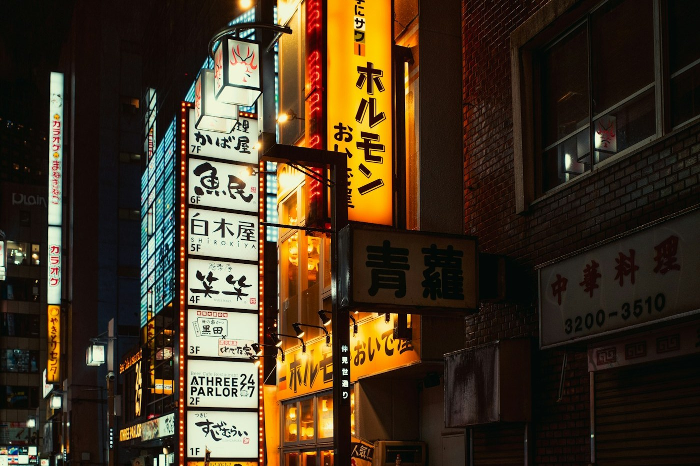
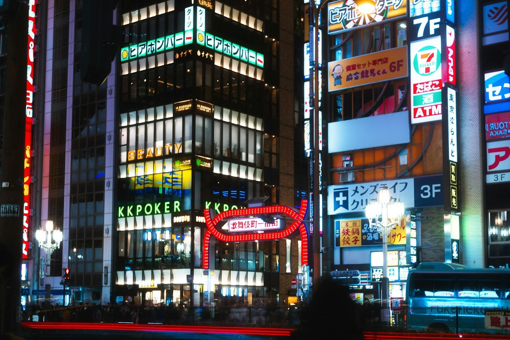

# Tokyo — Shinjuku, the first night

*Saturday 4 April*

{frame=box}

Landed at 6:40 in the morning, which is a cruel hour to arrive anywhere. By the time the train reached Shinjuku I had been awake for 27 hours and the station had eleven exits, all of them wrong.

## What happened

The hotel let us leave the bags, so we walked. Every street here is a canyon of signs, and every sign is shouting, and somehow it is calm. Ate a bowl of udon standing at a counter because sitting down felt like it would end the day. It was ¥480 and it was perfect.

{frame=box}

By nine the neon was on and I had stopped being tired in the way that means you are now dangerously awake. Golden Gai: a grid of bars the width of a corridor, six stools each. We picked one because the door was open and the woman behind the bar was laughing at something. She poured whisky, put a plate of pickles in front of us we had not ordered, and would not let us pay for the pickles.

## Notes to self

- The trains stop just after midnight. Nobody warns you.
- A konbini egg sandwich is a genuine breakfast, not a joke breakfast.
- [ ] Go back to that bar on the last night, if we can ever find it again

> Rule established tonight: no phone maps after 10 pm. Getting lost is the point.

---

Photos: Intrepid, Jaipreet Singh / Unsplash

#travel/japan/tokyo
