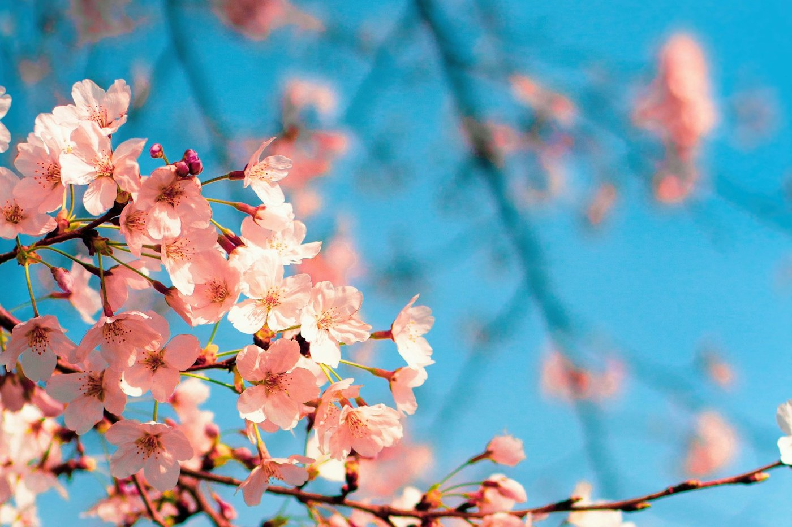

# Tokyo — Yanaka, the old town

*Sunday 5 April*

Everyone goes to Shibuya on day two. We went the other way, north, to the bit of Tokyo the war and the earthquakes somehow missed. Yanaka is low wooden houses, temples on every corner, cats on every temple, and a shopping street that closes at five like it has somewhere to be.

{frame=box}

## The cemetery

The cemetery is the thing. A long avenue of cherry trees through the middle of it, in full flower today, petals coming down on the gravestones like the weather had been booked. People bring picnics. Nobody thinks this is strange, and after ten minutes neither did I.

A man with a small dog told us (I think) that the trees are older than the cemetery. The dog was wearing a raincoat. It was not raining.

## Yanaka Ginza

The shopping street: a butcher selling menchi-katsu out of a window for ¥250, eaten on the steps at the end of the road that everyone calls the *sunset stairs*. Seven cats counted, two of them statues, one of them arguable.

- [x] Menchi-katsu
- [x] The sunset stairs at sunset (the name is accurate)
- [ ] The tiny stationery shop — go back with money

> This is the Tokyo I will describe to people. Shinjuku is the one they will ask about.

---

Photo: Ling Xian Su / Unsplash

#travel/japan/tokyo
