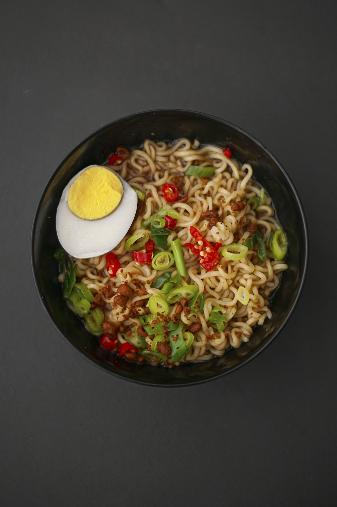
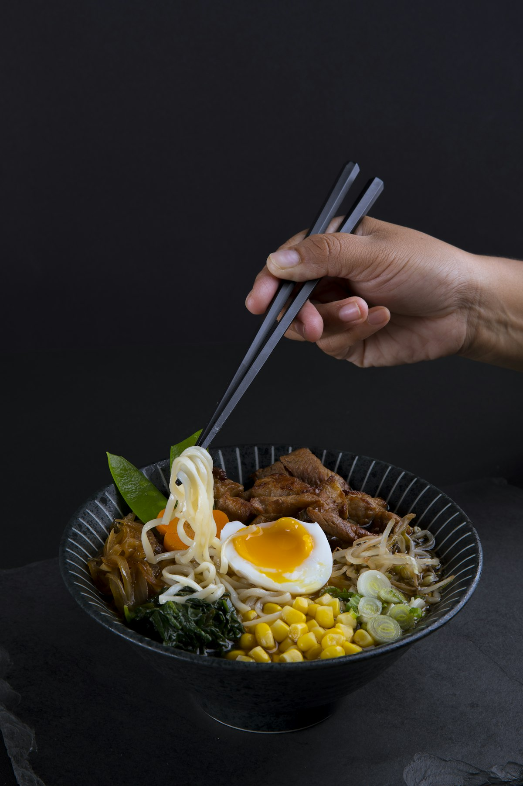

# Tonkotsu ramen, the long way

{frame=comic align=right w=260}

This takes a whole day. That is not a warning, it is the recipe.

## Ingredients

- [ ] 2 kg pork bones — trotters and neck, ask the butcher nicely
- [ ] 1 whole head of garlic
- [ ] 2 onions, unpeeled, halved
- [ ] Thumb of ginger
- [ ] 6 eggs, for the *ajitama*
- [ ] Soy, mirin, sake — equal parts, for the eggs
- [ ] Fresh ramen noodles
- [ ] Spring onions, nori, bamboo shoots

## Method

1. **Blanch** the bones for ten minutes, pour it all away, scrub the pot. This is the step everyone skips and then wonders why the broth is grey.
2. Cover with cold water, bring to a **rolling** boil and keep it there. Not a simmer. Eight hours, topping up. The kitchen will smell like a good decision.
3. Halfway through, drop in the garlic, onions and ginger.
4. Eggs: 6 minutes 30 in boiling water, straight into ice, peel, then overnight in the soy-mirin-sake.
5. Strain. The broth should be the colour of a latte and coat a spoon.
6. Noodles for 90 seconds, no more. Bowl, broth, noodles, egg, the rest.

{frame=print w=420}

> `tare` is the seasoning you add to the bowl, not the pot — that is how one broth makes shio, shoyu and miso.

---

Photos: ikhsan baihaqi, Bon Vivant / Unsplash

#examples/recipes #recipes
