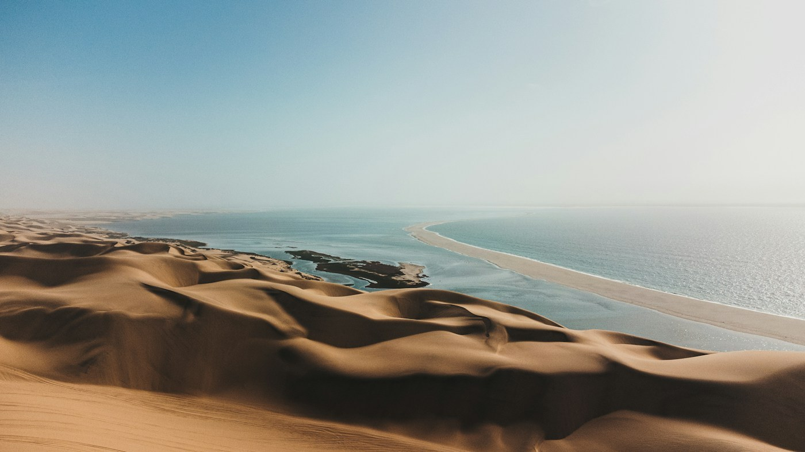
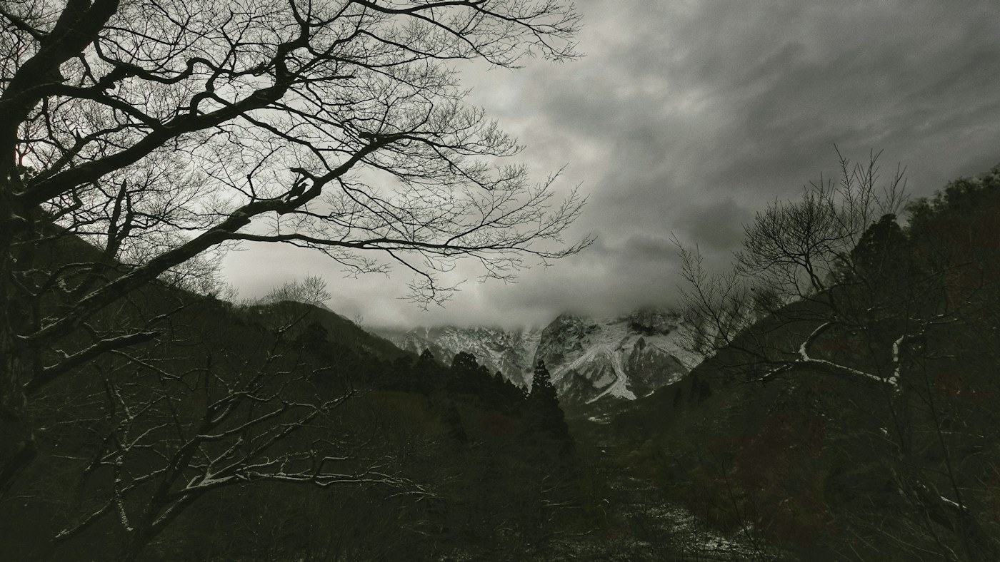

# Tottori — sand dunes, of all things

*Tuesday 14 April*

Nobody goes to Tottori. It is the least-populated prefecture in the country, the train there takes most of a morning, and at the end of it there is a desert on a beach.

{frame=box}

## The dunes

Sixteen kilometres of sand dunes, some of them fifty metres high, pushed up against the Sea of Japan by the wind. You climb the big one — it is harder than it looks, like every dune — and at the top there is the sea on one side, the town on the other, and a man renting camels. Camels. In Japan.

We did not ride the camel. We did stand next to it for a photo and it looked at us with the exact expression of a cat.

## The museum made of sand

Next to the dunes there is a museum where sculptors from around the world come each year and carve an entire exhibition out of sand, and then in winter it is bulldozed and they start again. This year's theme was somewhere I have been. It was wildly better than it has any right to be.

{frame=box}

## After

Crab. Tottori is where the crab comes from, and it was the end of the season, and the woman in the restaurant apologised for it being the end of the season while putting a crab the size of a dinner plate in front of me.

- [x] Climb the big dune
- [x] Not ride the camel
- [x] Sand museum
- [x] Crab, apologised for
- [ ] Paragliding off the dunes — there was a sign; next time

> Going where nobody goes is the best decision on this trip. Zero queues. One camel.

---

Photos: Nir Himi, Nakaharu Line / Unsplash

#travel/japan/tottori
