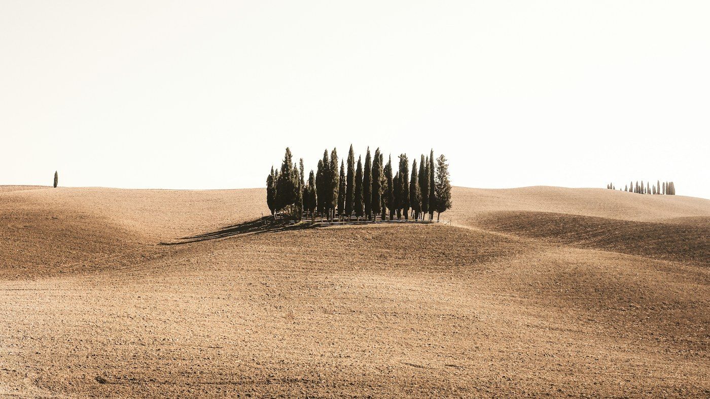
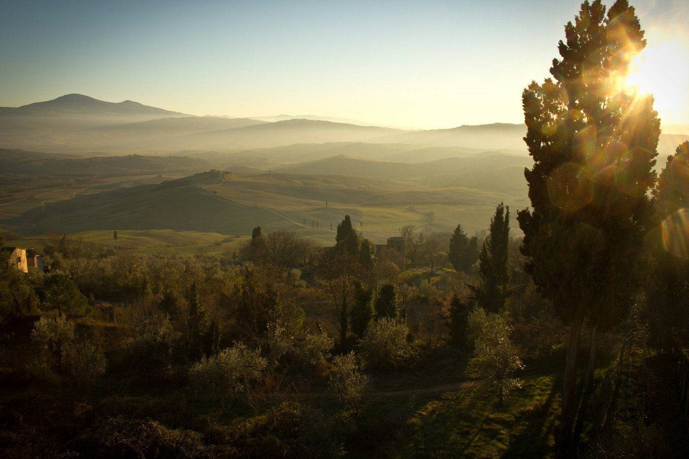
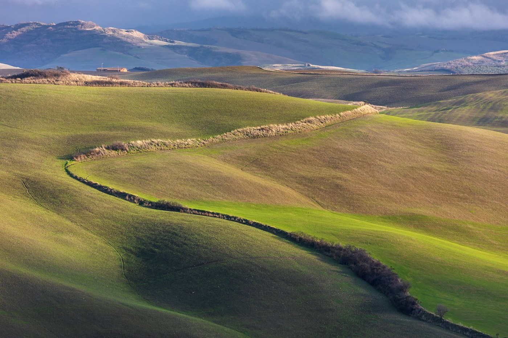

# Val d'Orcia — cypresses and a hot square

*Friday 18 – Saturday 19 September*

{frame=box}

The valley south of Siena that is on every calendar: bare rolling hills, a farmhouse on each one, a line of cypresses up to each farmhouse. It is a UNESCO landscape, which means the view is protected, which means it looks exactly like the calendar, which is unsettling and then wonderful.

## The drive

You just drive. Every bend is the picture. The famous group of cypresses in a field near San Quirico has a lay-by and a small crowd at sunset and we joined it and did not mind. Pienza, the town a pope rebuilt as a perfect Renaissance city and then died before it was finished, is one street long and smells entirely of pecorino, which is the cheese, which is the point.

{frame=box}

## The hot square

Here is the odd one. Bagno Vignoni is a village whose main square is not a square but a pool: a great stone basin of hot spring water, steaming, in the middle of the houses, where the Medici bathed and Saint Catherine bathed and now nobody is allowed to bathe. But the water runs out of the square down the hill in channels the old mills used, and at the bottom, in the woods, it collects in warm rock pools, and there you *are* allowed. We sat in a warm pool in a wood in Tuscany at dusk with nobody else there. Free. Nobody at home will believe the free part.

{frame=box}

## The farm

Two nights at an agriturismo on a hill with a dog, a pool, and dinner at one long table with a Dutch couple, a family from Turin, and whatever the farm had made that day. Olive oil from the trees you could see. The dog was called Rocco. Rocco has opinions.

- [x] The cypresses, at the lay-by, at sunset
- [x] Pienza, pecorino
- [x] The hot square, the warm pools in the wood
- [x] Rocco
- [ ] Monticchiello, the village with the play — the season was over

> Two days of doing very little, done very well.

---

Photos: Cristina Gottardi, Daniel Genser, Samuele Bertoli / Unsplash

#travel/tuscany/val-d-orcia
