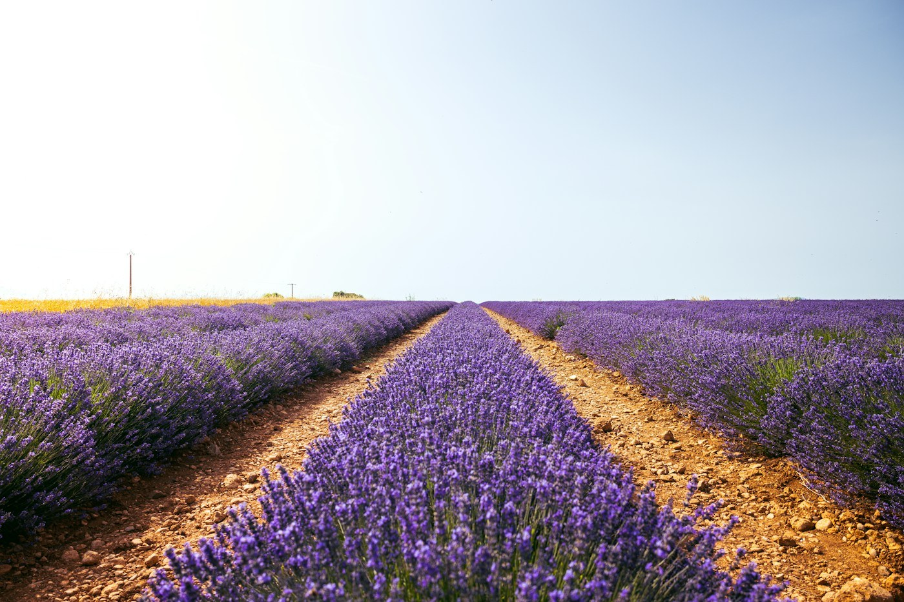
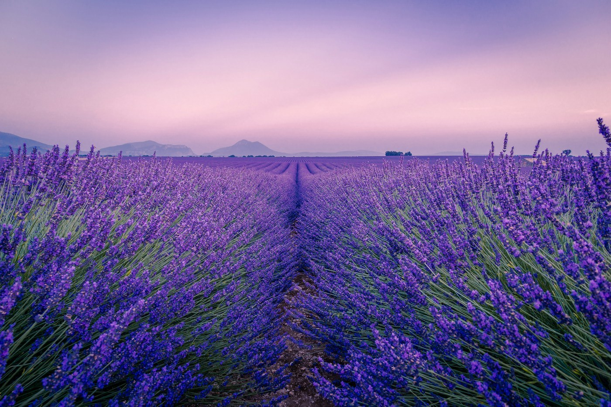

# Valensole — the lavender

*Sunday 28 – Monday 29 June*

{frame=box}

The plateau of Valensole, east of everything, where the lavender is. We timed the whole trip around the last week of June and the timing was right: the fields were purple to the edge of the sky and the air smelt like the inside of a drawer.

## The fields

You drive, and there is a field, and you stop, and there is a better one. Bees. The hum of a whole plateau of bees. A farmer selling honey and lavender oil from a table at the end of his rows, who let us walk in as long as we did not pick. Everyone was taking the same photograph; I took it too.

{frame=box}

## Evening

We stayed two nights in a farmhouse on the plateau, because after nine days of villages we wanted to stop. Dinner outside. The lavender goes grey-blue as the light goes, then the hills go black, then it is just the smell and the stars. The Verdon gorge is an hour away and we did not go. We sat.

## The last morning

Drove back to Nice along the top of the Verdon anyway, because the road was there. Turquoise river a long way down. Gave the car back with the garlic still in it.

- [x] The fields at their peak
- [x] Honey and oil from the farmer
- [x] Two nights, nothing planned, nothing done
- [ ] Verdon properly — kayaks — a different trip

> Nine days, eight places, one boat, no hat. See [[South of France — the budget]] for what it cost.

---

Photos: Simon Spring, Antony BEC / Unsplash

#travel/south-of-france/valensole
