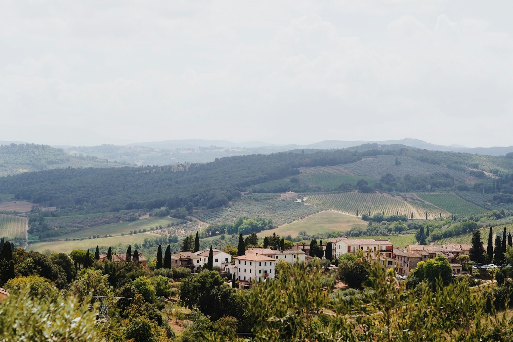
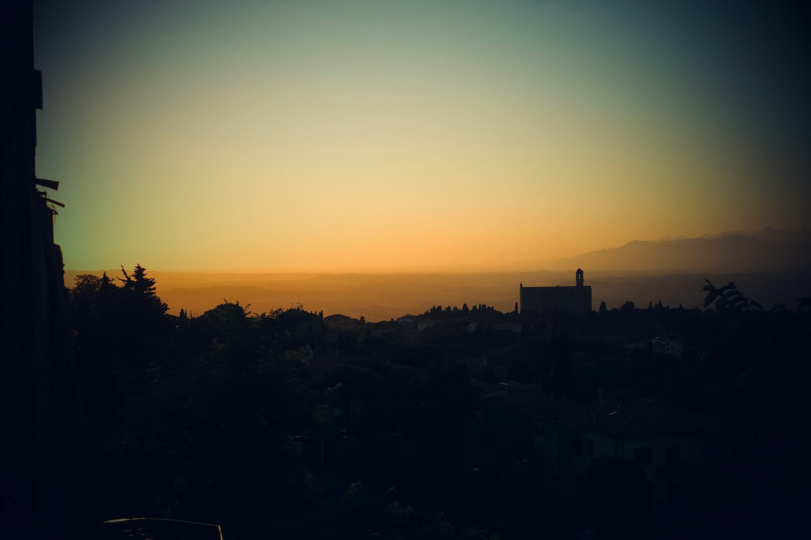

# Volterra — alabaster and Etruscans

*Tuesday 15 September*

{frame=box}

South through hills that get browner and emptier, to a town on a ridge that was old when Rome was a village. The Etruscans built it. The Romans took it. The Medici took it. The vampire films took it, briefly, and the town has not quite forgiven them.

## Alabaster

Volterra's thing is alabaster — soft white stone from the hills — and half the shops are workshops where a man with a mask on is turning a lamp on a lathe in a cloud of white dust. We watched one for twenty minutes. He gave us a piece of offcut. It is translucent when you hold it to the light. It is in the car with the half a buccellato.

## The Etruscans

A museum of Etruscan funeral urns, hundreds of them, each with the dead person reclining on the lid looking pleased with themselves. One of them — the *Ombra della Sera*, a bronze figure stretched thin as a shadow at evening — is the best thing in any museum on this trip and it is the size of a ruler. (I said no more museums. This is not a museum. It is urns.)

{frame=box}

## The evening

The Roman theatre below the walls, seen from above at sunset for free, which is the correct price. Dinner in a place that only did wild boar in four ways. Had it two ways.

- [x] Alabaster workshop
- [x] The urns
- [x] Shadow of the evening
- [x] Wild boar, two of four ways
- [ ] The other two ways

> A town that has been on top of its hill for 3,000 years and intends to stay.

---

Photos: Laura Chouette, Benoît Vrins / Unsplash

#travel/tuscany/volterra
