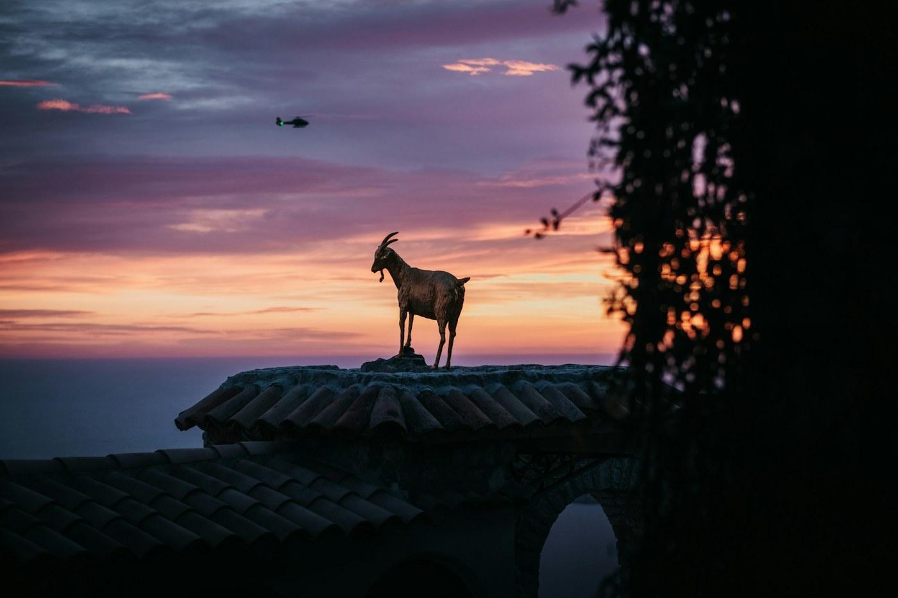
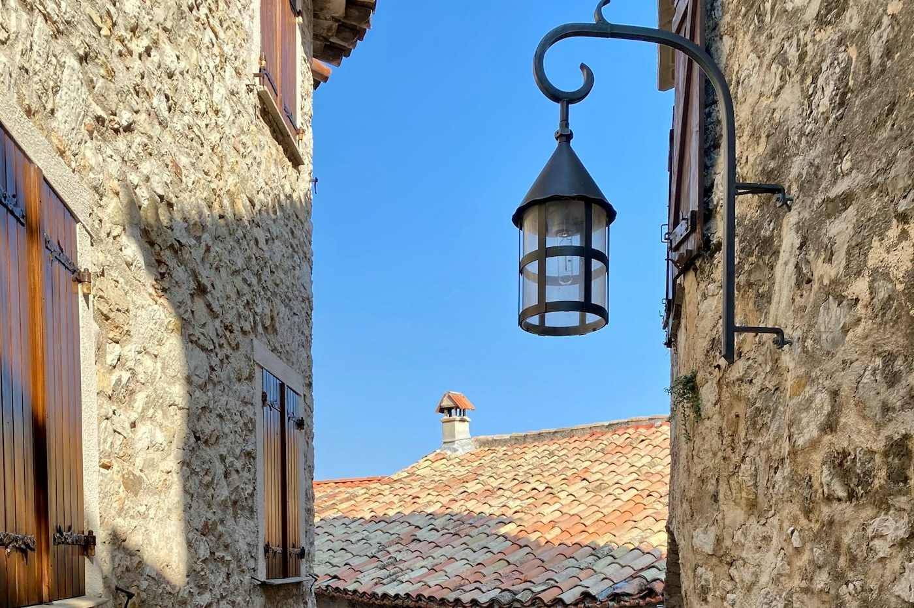

# Èze — the goat on the roof

*Sunday 21 June*

{frame=box}

Out of Nice airport, twenty minutes along the coast road, and up. Èze is a medieval village stuck to the top of a rock four hundred metres above the sea, and the whole thing is stairs.

## The village

Cobbles, arches, doorways the height of a short person, geraniums in every window. A cactus garden at the summit where the ruins of the castle used to be, and from the top you can see Cap Ferrat, the sea going white in the wind, and — I swear — a goat standing on somebody's roof, watching the sunset like it had paid for the view.

{frame=box}

## Dinner

A restaurant with four tables and a woman who told us what we were having. Ratatouille, then a fish she named and I forgot, then a lemon tart so sharp it made us both sit up straight. Nothing to decide, all of it right.

- [x] Climb everything
- [x] The cactus garden
- [x] A goat, on a roof, at sunset
- [ ] The perfume factory down the hill — skip it, tomorrow is the sea

> Jet lag, sea air, stairs. Asleep by nine, and not sorry.

---

Photos: Joachim Lesne, Armand Khoury / Unsplash

#travel/south-of-france/eze
